# Networking Profiles for Members

**Document version:** 1.0  
**Date:** September 5, 2026  
**Status:** Discovery / architecture only — **no implementation in this phase**  
**Scope:** `ontapnewsystem` (TAP portal)  
**Related:**
- [`docs/FEATURE_INTEGRATION_RECOMMENDATIONS.md`](FEATURE_INTEGRATION_RECOMMENDATIONS.md) §5.5 (prior sketch; this document is the detailed Networking blueprint)
- [`docs/Attendance & Event Monitoring.md`](Attendance%20&%20Event%20Monitoring.md) (event participation SoT for event networking)
- [`docs/Voting System & Loyalty Card.md`](Voting%20System%20&%20Loyalty%20Card.md) (loyalty remains separate; no auto-award for networking spam)

---

## Table of Contents

1. [Executive Overview](#1-executive-overview)
2. [Strict Discovery — What Exists Today](#2-strict-discovery--what-exists-today)
3. [Product Vision](#3-product-vision)
4. [Member Networking Profile](#4-member-networking-profile)
5. [Profile Source of Truth](#5-profile-source-of-truth)
6. [Profile Visibility & Privacy](#6-profile-visibility--privacy)
7. [Member Discovery](#7-member-discovery)
8. [Search Architecture](#8-search-architecture)
9. [Member Directory](#9-member-directory)
10. [Member Profile View](#10-member-profile-view)
11. [Connection System](#11-connection-system)
12. [Connection Request Message](#12-connection-request-message)
13. [My Network](#13-my-network)
14. [Messaging Integration](#14-messaging-integration)
15. [NFC Networking Flow](#15-nfc-networking-flow)
16. [QR Networking Flow](#16-qr-networking-flow)
17. [Profile Sharing](#17-profile-sharing)
18. [Event-Based Networking](#18-event-based-networking)
19. [Event Networking Mode](#19-event-networking-mode)
20. [Mutual Connections](#20-mutual-connections)
21. [Networking Recommendations](#21-networking-recommendations)
22. [Why Connect Experience](#22-why-connect-experience)
23. [Networking Intent](#23-networking-intent)
24. [Profile Completion](#24-profile-completion)
25. [Member Discovery Controls](#25-member-discovery-controls)
26. [Block / Report](#26-block--report)
27. [Moderation](#27-moderation)
28. [Staff Role](#28-staff-role)
29. [Superadmin Role](#29-superadmin-role)
30. [Organization Admin](#30-organization-admin)
31. [Cross-Organization Networking](#31-cross-organization-networking)
32. [NFC / QR Identity Security](#32-nfc--qr-identity-security)
33. [Connection Security](#33-connection-security)
34. [Rate Limiting](#34-rate-limiting)
35. [Privacy](#35-privacy)
36. [Profile Activity](#36-profile-activity)
37. [Networking Analytics](#37-networking-analytics)
38. [Profile Views](#38-profile-views)
39. [Notifications](#39-notifications)
40. [Loyalty Integration](#40-loyalty-integration)
41. [Missions / Rewards Integration](#41-missions--rewards-integration)
42. [Attendance Integration](#42-attendance-integration)
43. [Membership Integration](#43-membership-integration)
44. [Digital BizCard Integration](#44-digital-bizcard-integration)
45. [Profile Save / Contact Save](#45-profile-save--contact-save)
46. [Business Opportunity](#46-business-opportunity)
47. [User Experience](#47-user-experience)
48. [Dashboard Experience](#48-dashboard-experience)
49. [Networking Page / Navigation](#49-networking-page--navigation)
50. [Database Model](#50-database-model)
51. [Connection Data Model](#51-connection-data-model)
52. [API Architecture](#52-api-architecture)
53. [Idempotency](#53-idempotency)
54. [Concurrency](#54-concurrency)
55. [Fraud / Abuse](#55-fraud--abuse)
56. [Search Privacy](#56-search-privacy)
57. [Event Networking Security](#57-event-networking-security)
58. [Cross-Organization Architecture](#58-cross-organization-architecture)
59. [Reporting](#59-reporting)
60. [Business Admin Dashboard](#60-business-admin-dashboard)
61. [MVP](#61-mvp)
62. [Future Features](#62-future-features)
63. [Future Business Model](#63-future-business-model)
64. [End-to-End Flowcharts](#64-end-to-end-flowcharts)
65. [System Integration Map](#65-system-integration-map)
66. [MVP vs Future](#66-mvp-vs-future)
67. [File Impact Analysis](#67-file-impact-analysis)
68. [Implementation Order](#68-implementation-order)
69. [Testing Strategy](#69-testing-strategy)
70. [Open Business Questions](#70-open-business-questions)
71. [Final Architecture Recommendation](#71-final-architecture-recommendation)
72. [Closing Summary](#72-closing-summary)

---

## Label legend

| Label | Meaning |
|---|---|
| **[VERIFIED EXISTING]** | Confirmed in the current codebase |
| **[PROPOSED]** | Recommended future architecture (not implemented) |
| **[NOT FOUND]** | Could not be verified in the current codebase |
| **[SHARED]** | Owned by another domain; networking consumes it |
| **[ASSUMED]** | Reasonable inference; not proven in code |
| **[FUTURE PHASE]** | Explicitly deferred |

---

## 1. Executive Overview

**[PROPOSED]** Networking Profiles for Members is a **professional member networking layer inside TAP** — not a passive member directory dump.

TAP already has the relationship engine (**Associates / `Connection`**), the public professional face (**BizCard / portfolio**), gated **messaging**, **NFC/QR serial identity**, and **notifications**. What is missing is a discoverable, privacy-aware networking profile, org-scoped member discovery, intent-based relevance (“why connect”), and event-context networking that consumes attendance without duplicating it.

**Chosen architecture (locked):**

```text
User (auth)
  → Company affiliation (interim membership eligibility)
  → BizCard (public identity + NFC/QR credential)
  → NetworkingProfile [PROPOSED] (intent, skills, privacy)
  → Discovery directory [PROPOSED]
  → Connection / Associates [EXISTING]
  → Messaging [EXISTING]
  → Event attendee discovery [PROPOSED, depends on Attendance]
```

This matches **FEATURE_INTEGRATION §5.5 Option A** and product Option **C**: a separate networking layer that **references** BizCard and **extends** Associates — it does **not** replace BizCard and does **not** create a second connection graph.

**MVP org boundary:** same-`Company` discoverable directory + member discoverability toggles. Cross-organization discovery is Phase 2+ (see §31, §70).

---

## 2. Strict Discovery — What Exists Today

### 2.1 Authentication & identity

| Concern | Status | Evidence |
|---|---|---|
| Registration / OTP / login | **[VERIFIED EXISTING]** | `app/api/auth/register`, `verify-email`, `login`, `session`, `logout` |
| Opaque DB sessions + cookies | **[VERIFIED EXISTING]** | `server/lib/auth.ts`, `Session` models |
| Roles | **[VERIFIED EXISTING]** | `user`, `company_admin`, `staff`, `super_admin`, `dev` |
| Company RBAC | **[VERIFIED EXISTING]** | `CompanyEmployee.role` + JSON permissions; `server/lib/company.ts` |
| Account profile | **[VERIFIED EXISTING]** | `User`, `/api/user/profile`, Settings |

### 2.2 User Portal — networking-relevant modules

| Module | Nav / path | Status | Notes |
|---|---|---|---|
| Dashboard | `/user/dashboard` | **[VERIFIED EXISTING]** | Associates count, profile views, contact saves, QR/share |
| My BizCards | `/user/bizcard-list` | **[VERIFIED EXISTING]** | Card CRUD; public portfolio at `/{alias}` |
| Associate | `/user/associate` | **[VERIFIED EXISTING]** | Connected / online / pending / sent; message; view card |
| Inquiry | `/user/inquiry` | **[VERIFIED EXISTING]** | Visitor inquiries to BizCard — not peer networking |
| Missions | `/user/missions` | **[VERIFIED EXISTING]** | Growth Missions & Rewards |
| Settings | `/user/settings` | **[VERIFIED EXISTING]** | Account, notification prefs, sessions |
| Messages (peer DM) | Panel (no dedicated `/user/messages`) | **[VERIFIED EXISTING]** | `ConnectionMessengerPanel`; connection-gated |
| Contact Saves | `/user/contact-saves` | **[VERIFIED EXISTING]** | Analytics; not main nav |
| Member directory | — | **[NOT FOUND]** | Gap |
| Networking intent / skills | — | **[NOT FOUND]** | Gap |
| Follow system | — | **[NOT FOUND]** | — |

### 2.3 Associates = existing connection system

**[VERIFIED EXISTING]** Product label **Associate**; data model **`Connection`**.

| Field / behavior | Detail |
|---|---|
| Pair | `requester_user_id` ↔ `recipient_user_id` |
| Types | `relationship_type`: `friend` \| `associate` (same table) |
| Status | `pending` (default), `accepted`, `declined`, `blocked` (via respond/block flows) |
| Uniqueness | `@@unique([requester_user_id, recipient_user_id])` |
| Tags | `ConnectionTag` (owner tags a target user) |
| Blocks | `BlockedUser` |
| Mutuals / social proof | Portfolio APIs + connections lib |
| Suggestions | `/api/connections/suggestions` — naïve “newest active users” |
| UI | `AssociateUser.tsx`; portals: user / admin / staff |

**Critical product rule:** Networking Profiles **must evolve Associates**, not invent a parallel friends/connections product.

### 2.4 BizCard / Digital BizCard / public profile

**[VERIFIED EXISTING]**

- Public identity: portfolio `/{url_alias|custom_uri}` via `app/[alias]/`
- Fields include name, title/occupation, bio, email, phone, socials, services, products, images, theme
- Digital BizCard UI: downloadable themed card + vCard QR + share portfolio URL — **not** a separate Prisma model
- Physical NFC/QR: `Bizcard.serial_id` → `GET /api/public/scan/[serialId]` → portfolio / claim / merge
- Preferences: `show_associate_count`, `show_mutual_associates`, inquiry card toggles

### 2.5 Messaging

**[VERIFIED EXISTING]** `lib/services/connection-messaging.service.ts` → `assertCanMessage`:

1. Accepted `Connection` between peers → allowed  
2. Else same company: primary/co-admin ↔ members allowed; employee ↔ employee blocked unless Associates  
3. Block either direction → denied  

**Open messaging to strangers: [NOT FOUND].** Networking should not create a second messenger.

### 2.6 NFC / QR

| Capability | Status |
|---|---|
| Serial URL resolve → portfolio | **[VERIFIED EXISTING]** |
| QR generation / scan analytics | **[VERIFIED EXISTING]** |
| In-app Web NFC read/write | **[NOT FOUND]** |
| Multi-context scan router (attendance / vote / network) | **[NOT FOUND]** (docs only) |

NFC/QR today **identify and open** a profile. They do **not** auto-create connections.

### 2.7 Staff / Superadmin / Company admin

| Portal | Networking-relevant today |
|---|---|
| Staff | Associate UI (same as user), Clients CRM, Support messages — **not** org membership networking admin |
| Superadmin | Users, Companies, BizCards, restrict/recycle, Missions, broadcasts |
| Company (`/admin`) | Associate, Company employees, analytics permissions |

### 2.8 Membership

**First-class `Membership` / renewals domain: [NOT FOUND].**

Interim identity stack:

| Concept | Implementation |
|---|---|
| Person | `User` (`is_active`, `is_restricted`, …) |
| Org affiliation | `Company` + `CompanyEmployee` |
| Product access | `Bizcard.subscription_*`, `BizcardSubscription` |
| Physical credential | `Bizcard.serial_id`, `EmployeeCard.serial_id` |

Networking **consumes** eligibility; it must not invent a second member identity. When Membership ships (FEATURE_INTEGRATION), Networking switches to that SoT.

### 2.9 Events & Attendance

| Capability | Status |
|---|---|
| User calendar + RSVP | **[VERIFIED EXISTING]** `CalendarEvent`, `CalendarEventAttendance` |
| Managed Event / venue check-in | **[PROPOSED]** Attendance doc only |
| Event networking directory | **[NOT FOUND]** |

Event networking **depends on** Attendance for “who is actually here.” Do not treat RSVP as check-in.

### 2.10 Loyalty / Voting / Missions

| Feature | Status | Networking rule |
|---|---|---|
| Growth Missions & Rewards | **[VERIFIED EXISTING]** | Optional future missions; anti-abuse required |
| Spin / roulette | **[VERIFIED EXISTING]** | Stay separate |
| Org Loyalty ledger | **[NOT FOUND]** | Do not auto-award networking points |
| Voting | **[NOT FOUND]** | No coupling in MVP |

### 2.11 Notifications

**[VERIFIED EXISTING]** Relevant event types in `server/lib/notifications.ts`:

- `friend_request_sent`, `friend_request_accepted`, `connection_added`
- `direct_message_received`
- `profile_view`, `contact_download`, `profile_shared` (prefs)

Reuse this infrastructure; do not build a second notification stack.

### 2.12 Gap summary

| Gap | Impact |
|---|---|
| No member directory / search | Cannot discover beyond suggestions + portfolio URL |
| No networking intent / skills | Weak “why connect” |
| No discoverability privacy for directory | Membership existence ≠ permission to list |
| No event-context “people here” | Misses TAP’s NFC/event differentiator |
| Suggestions are naïve | Not industry/intent based |
| No networking-specific report queue | Abuse path incomplete for directory |

---

## 3. Product Vision

### Directory vs Networking

**Directory (insufficient alone):**

```text
Member → View profile
```

**Networking (target):**

```text
Member → Discover → Understand relevance → View profile
  → Connect → Accept → Build network → Communicate → Follow up → Relationship
```

**Product definition:** A professional member networking layer inside TAP that transforms **MEMBERS → CONNECTIONS → RELATIONSHIPS**, using BizCard as the public face and Associates as the trust graph.

TAP should evolve from “NFC digital business card” toward **member engagement + identity + networking** for associations, clubs, companies, schools, communities, and events — without becoming an unrestricted people database.

---

## 4. Member Networking Profile

### 4.1 Field categories

#### Identity — mostly [SHARED] from User / BizCard

| Field | Source | MVP |
|---|---|---|
| Profile photo | User / BizCard | Yes (read) |
| Name | User / BizCard | Yes |
| Display name | Prefer BizCard / User name | Yes |
| Organization / company | `Company` / BizCard company | Yes |
| Membership status | Membership **[PROPOSED]** / interim User+subscription | Show only if policy allows |

#### Professional — mix of BizCard + NetworkingProfile

| Field | Source | MVP |
|---|---|---|
| Position / title | User `job_position` / BizCard `professional_title` / `occupation` | Yes (read) |
| Industry | **[PROPOSED]** NetworkingProfile | Yes |
| Short introduction / headline | **[PROPOSED]** NetworkingProfile | Yes |
| Bio | BizCard `bio` (optional deep link) | Link, not duplicate |
| Company / business label | Company / BizCard | Yes |

#### Contact / Social — privacy-gated [SHARED]

| Field | Source | MVP |
|---|---|---|
| Email / phone visibility | BizCard + **[PROPOSED]** networking privacy flags | Yes (toggles) |
| Website / socials | BizCard `Social` | Show per BizCard + privacy |
| “View BizCard” CTA | Portfolio URL | Yes |

#### Networking-specific — [PROPOSED] NetworkingProfile only

| Field | MVP |
|---|---|
| What I do | Yes (short text) |
| Looking for | Yes (selectable intents) |
| Can help with | Yes (selectable offers) |
| Skills / expertise (limited tags) | Yes (small set) |
| Interests | Phase 2 |
| Availability status | Yes (simple enum) |

#### Availability statuses **[PROPOSED]** (MVP subset)

| Status | MVP |
|---|---|
| Open to networking | Yes |
| Looking for clients | Yes (via Looking for) |
| Looking for partners | Yes |
| Looking for suppliers | Yes |
| Looking for opportunities | Yes |
| Available for collaboration | Phase 2 |
| Not currently available | Yes (`open_to_connect = false`) |

**Do not ship every field.** MVP = identity from existing systems + headline + industry + what I do + looking for + can help with + discoverability + open_to_connect.

---

## 5. Profile Source of Truth

### 5.1 Ownership matrix

| Data | Owner | Networking role |
|---|---|---|
| Auth identity, email login, password, sessions | **User Account** | Never duplicate |
| Member eligibility, org membership, active/expired (**future**) | **Membership** **[PROPOSED]** | Consume |
| Company affiliation (today) | **Company / CompanyEmployee** | Interim eligibility + org directory boundary |
| Public professional card, socials, services, serial, QR, portfolio | **BizCard** | Public face; NFC/QR target |
| Subscription tier / expiry | **BizCard subscription** | Access gate **[SHARED]** |
| Networking intent, skills, discoverability, privacy for directory | **NetworkingProfile** **[PROPOSED]** | Own |
| Relationship graph | **Connection** **[EXISTING]** | Own (do not fork) |
| Peer messages | **DirectConversation / DirectMessage** | Own |
| Event participation | **EventAttendance** **[PROPOSED]** | Consume for “people at event” |
| Notifications | **Notification*** **[EXISTING]** | Emit events into |

### 5.2 Architecture choice (locked)

| Option | Decision |
|---|---|
| A. Extend BizCard with all networking fields | Rejected — pollutes marketing card; mixes public web with member-only intent |
| B. Reuse BizCard alone as networking profile | Rejected — no directory/privacy/intent model |
| **C. Networking layer references BizCard** | **Chosen** |

```text
TAP Member (User)
  ├── BizCard / Portfolio     → public professional identity
  └── NetworkingProfile       → member-only networking metadata + privacy
        └── primary_bizcard_id (optional FK) → “View my BizCard”
```

Aligns with FEATURE_INTEGRATION §5.5 Option A (`MemberProfile` naming may be `NetworkingProfile` for clarity).

---

## 6. Profile Visibility & Privacy

### 6.1 Controls **[PROPOSED]**

| Control | Values | Effect |
|---|---|---|
| Discoverability | `discoverable` \| `hidden` | Hidden: never in directory, suggestions, or event lists (except explicit profile URL if still allowed) |
| Profile visibility | `org_members` \| `connections_only` \| `limited` | Who can see networking detail beyond card teaser |
| Contact visibility | show/hide email, show/hide phone | Overrides directory/detail payloads |
| Networking availability | `open` \| `limited` \| `off` | `off` ⇒ no connect CTA / `open_to_connect=false` |
| Event visibility | `visible_at_events` \| `hidden_at_events` | Independent of org directory if needed |

### 6.2 Discovery rules

1. Membership/User existence **alone** does **not** imply directory listing.  
2. Listing requires: eligible member + `discoverable` + org policy networking enabled + not blocked/restricted.  
3. Contact fields never appear in search cards; only on detail if allowed.  
4. Public portfolio URL remains BizCard-controlled; networking CTAs require auth + eligibility.

### 6.3 MVP minimum privacy set

- Discoverable / Hidden  
- Open to connect on/off  
- Show email / Show phone (default hide in networking views)  
- Visible at events on/off (default on if discoverable)

---

## 7. Member Discovery

### 7.1 Goal

Help members find **relevant** people inside their organization (MVP), not browse the entire TAP user table.

### 7.2 Search dimensions

| Dimension | MVP | Later |
|---|---|---|
| Name | Yes | — |
| Industry | Yes | — |
| Company / org (implicit same company) | Yes | Cross-org |
| Looking for / Can help with | Yes | — |
| Title / occupation | Yes (from User/BizCard) | — |
| Skills | Light | Full |
| Location | If city already on BizCard — optional filter | — |
| Event participation | With Attendance | — |
| Membership type | When Membership exists | — |

### 7.3 Filters (smallest useful set)

1. Industry  
2. Looking for  
3. Can help with  
4. Open to connect  
5. (Event context) checked-in discoverable attendees  

Avoid filter sprawl in MVP.

---

## 8. Search Architecture

### 8.1 Stack choice

**[VERIFIED EXISTING]** TAP uses Prisma + MySQL.  
**[PROPOSED]** MVP search = **database filtering + indexes + pagination**. No Elasticsearch/Meilisearch unless scale demands it later.

### 8.2 Query shape **[PROPOSED]**

```text
GET /api/network/discover
  ?q=
  &industry=
  &looking_for=
  &can_help_with=
  &open_to_connect=true
  &page=
  &pageSize=
  &sort=relevance|name|recent
```

Server steps:

1. Auth session + rate limit  
2. Resolve viewer `company_id` / eligibility  
3. Base set: same company employees/users with NetworkingProfile.discoverable  
4. Exclude self, blocked pairs, restricted users  
5. Apply filters + optional `q` on name/headline/industry (`LIKE` / indexed columns)  
6. Sort + paginate  
7. Return **minimized** card DTO (no email/phone)

### 8.3 Indexes **[PROPOSED]**

On `NetworkingProfile`: `(company_id, discoverable, open_to_connect)`, `industry`, generated/normalized looking_for/can_help tags as needed.  
Join User/BizCard for name search via existing indexes where possible.

### 8.4 Performance

- Cap `pageSize` (e.g. 20)  
- Hard max pages or cursor pagination  
- Cache filter option enums  
- Do not return full bios in list endpoints  

---

## 9. Member Directory

### 9.1 Card content (minimal)

| Show | Why |
|---|---|
| Photo | Recognition |
| Name | Identity |
| Title | Role |
| Organization | Context |
| Industry | Relevance |
| Looking for / Can help (one line each) | Why connect |
| Open / connection status | Action clarity |

**Do not** put email, phone, address, member numbers, or long bios on cards.

### 9.2 UX principle

Directory answers: **“Why should I connect with this person?”** — not a spreadsheet of members.

---

## 10. Member Profile View

### 10.1 Sections

| Section | MVP |
|---|---|
| Identity (photo, name, title, org) | Yes |
| Professional introduction (headline) | Yes |
| What they do | Yes |
| Expertise / skills | Yes (compact) |
| Networking intent (looking for / can help) | Yes |
| Availability | Yes |
| Social / View BizCard | Yes |
| Mutual connections (count) | Yes |
| Shared events | Phase 2 / with Attendance |
| Connection action (Connect / Pending / Message / Block) | Yes |

### 10.2 Questions the page must answer

1. Who is this person?  
2. What do they do?  
3. Why should I connect?  
4. What can we potentially do together?  

---

## 11. Connection System

### 11.1 Reuse existing lifecycle **[VERIFIED EXISTING]**

```text
Member A views Member B
  → Connect (POST /api/connections/request/send or portfolio connect)
  → PENDING
  → B notified (friend_request_sent)
  → Accept / Decline / Block
  → ACCEPTED → My Network (Associate) + messaging unlocked
```

### 11.2 Statuses

| Status | Required | Notes |
|---|---|---|
| `pending` | Yes | Existing |
| `accepted` | Yes | Existing |
| `declined` | Yes | Existing |
| `blocked` | Yes | Via `BlockedUser` + respond block |
| `cancelled` | Soft | Covered by remove/cancel on pending |

**Do not** create `NetworkingConnection` duplicate rows.

### 11.3 Entry points that must feed the same API

- Networking directory profile  
- Portfolio `/{alias}` connect  
- Event attendee card  
- NFC/QR opened profile (after auth)  

---

## 12. Connection Request Message

**[PROPOSED] Phase 2:** optional short note (“Met you at the August event…”).

**MVP:** no note — keep request UX identical to current Associates send flow to avoid schema/UI churn. Notifications already explain the request.

---

## 13. My Network

### 13.1 Surface

**[PROPOSED]** Evolve `/user/associate` (and admin/staff twins) as **My Network**, optionally under a Network nav group.

### 13.2 Show

| Item | Status |
|---|---|
| Connected members | **[VERIFIED EXISTING]** |
| Pending received | **[VERIFIED EXISTING]** |
| Sent requests | **[VERIFIED EXISTING]** |
| Online | **[VERIFIED EXISTING]** |
| Tags / filters | **[VERIFIED EXISTING]** |
| Recently connected | **[PROPOSED]** sort |
| Mutual connections | **[VERIFIED]** on list items where implemented |
| Shared events | **[PROPOSED]** after Attendance |

### 13.3 Actions

| Action | Support |
|---|---|
| View Profile / BizCard | Existing |
| Message | Existing (accepted) |
| Remove Connection | Existing |
| Block | Existing |
| Share Profile | Existing share portfolio patterns |
| Export contact | Existing VCF / contact save — privacy-aware |

---

## 14. Messaging Integration

**Principle:** Do **not** create a second messaging system.

```text
Profile → Connect → Accepted → Message → existing /api/messaging/*
```

**[VERIFIED EXISTING]** Messaging requires accepted connection (with company admin exception). Networking UI should mirror that: **Message** CTA only when messaging is allowed.

Staff Support messaging remains separate (`SupportConversation`) and is **not** member networking chat.

---

## 15. NFC Networking Flow

```text
Member A taps Member B's TAP NFC card
  → Serial URL resolve [EXISTING]
  → Portfolio / networking profile opens
  → A views public/member-allowed fields
  → A taps Connect (must be authenticated as A)
  → Pending → B notified → Accept
  → Both appear in My Network
```

**Rules:**

- NFC identifies the **profile/credential**, not an auto-connection.  
- No silent connect on tap.  
- Privileged actions require session as the acting user.  
- In-app Web NFC: **[NOT FOUND]** — physical URL tap is the path.

---

## 16. QR Networking Flow

Equivalent to NFC for MVP:

```text
Scan QR → open member profile URL → View → Connect → Accept → My Network
```

QR and NFC should share the same resolve → profile → connect pipeline (`scan` / portfolio routes). Behavioral difference only if product later adds booth “event mode” context parameters — **[FUTURE PHASE]**.

---

## 17. Profile Sharing

### 17.1 Existing **[VERIFIED]**

- Portfolio URL / `portfolio_url`  
- Web Share / clipboard (`sharePortfolioUrl`)  
- Portfolio QR / card QR  
- NFC serial URL  

### 17.2 Networking share **[PROPOSED]**

- Share button on networking profile → same portfolio URL (or deep link `#network` if needed)  
- Recipient sees public BizCard; Connect requires login + eligibility  
- Public link **never** grants edit, private fields, or acting as the owner  

---

## 18. Event-Based Networking

### 18.1 Target flow

```text
EVENT (ManagedEvent)
  → Member checks in (Attendance SoT)
  → Event networking unlocked for that member
  → “People at this Event”
  → Discover discoverable attendees
  → Filter by industry / intent
  → View → Connect → Follow up via Messages
```

### 18.2 Who appears in “People at this Event”

| Candidate set | Recommendation |
|---|---|
| All registered | Too broad / privacy risk |
| All eligible members of org | Not event-specific |
| **Checked-in + discoverable + event-visible** | **Chosen safest useful MVP** |
| RSVP-only | Weak signal; optional Phase 2 fallback **before** Attendance ships |

Attendance remains SoT for participation. Networking **reads** check-in; it does not write attendance rows.

---

## 19. Event Networking Mode

**[PROPOSED]** “Networking at Event” experience:

| Block | MVP approach |
|---|---|
| Attendees list | Checked-in discoverable members |
| People in your industry | Deterministic filter |
| Potential collaborators | looking_for ↔ can_help_with match |
| New connections | Not yet connected |
| People you may want to meet | Rule score (see §21) |

**No AI** unless infrastructure later exists. Deterministic rules only.

---

## 20. Mutual Connections

**[VERIFIED EXISTING]** Mutual associate counts / social proof on portfolio paths.

**[PROPOSED]** On networking profile:

- Show **count** by default (“You and Jane have 3 mutual connections”)  
- Full mutual list only if both parties’ privacy allows  
- Never expose another member’s entire network graph  

---

## 21. Networking Recommendations

### 21.1 MVP deterministic rules **[PROPOSED]**

Score candidates (same org, not connected, discoverable):

1. Complementary `looking_for` ↔ `can_help_with`  
2. Same industry  
3. Shared event (if Attendance)  
4. Mutual connections count  
5. Both `open_to_connect`  

Explainable reason string, e.g. “Also in Construction · Offers suppliers you’re looking for”.

### 21.2 Replace naïve suggestions

Upgrade `/api/connections/suggestions` to use NetworkingProfile rules when available; keep fallback for users without a networking profile.

### 21.3 Future AI

**[FUTURE PHASE]** embeddings / smart intros — explicitly out of MVP.

---

## 22. Why Connect Experience

Prefer:

```text
Jane Doe
Construction Consultant · ABC Company
Looking for: Business partnerships
Can help with: Project management
```

Over a bare name. Directory cards and recommendations always surface at least one relevance line.

---

## 23. Networking Intent

### 23.1 Looking for (MVP configurable enums)

- clients  
- partners  
- suppliers  
- collaborators  
- opportunities  
- other (free short text optional Phase 2)

### 23.2 Can help with (MVP)

- consulting  
- marketing  
- technology  
- sales  
- training  
- supplies / products  
- other  

**[PROPOSED]** Store as org-overridable catalogs later; ship platform defaults first. Do not hardcode dozens of categories in UI code without a config table if org customization is required (Phase 2).

---

## 24. Profile Completion

**[PROPOSED]** Soft completion meter:

```text
Networking Profile 70% complete
Missing: Professional introduction · Networking goal · Expertise
```

- Non-blocking  
- Dashboard nudge + empty-state CTAs  
- Do not lock discovery behind 100% unless business requires (default: require minimal headline + discoverable opt-in)

---

## 25. Member Discovery Controls

Minimum set (see §6):

| Control | MVP |
|---|---|
| Searchable / discoverable | Yes |
| Visible to organization directory | Yes (implied by discoverable + org scope) |
| Visible at events | Yes |
| Contact availability | Email/phone toggles |
| Networking availability | open_to_connect |

---

## 26. Block / Report

### 26.1 Block **[VERIFIED EXISTING]**

`BlockedUser` + connection respond block — stops requests and messaging both ways.

### 26.2 Report **[PROPOSED]**

| Capability | Notes |
|---|---|
| Report profile | Spam, harassment, inappropriate content, impersonation, suspicious, other |
| Report behavior | Same reasons |
| Remove connection | Existing |

### 26.3 Report routing

| Role | Responsibility |
|---|---|
| Company admin | First-line for org networking abuse **[PROPOSED]** |
| Superadmin | Escalation / platform restrict **[VERIFIED]** restrict patterns |
| Staff | Only if assigned moderation permission — **not** by default |

---

## 27. Moderation

**[PROPOSED]** Company admin / Superadmin can:

- View open reports  
- Hide networking profile / force undiscoverable  
- Suspend networking access for a member  
- Escalate to platform restrict  

**Do not** grant message content access unless existing support/escalation policy already allows it for that role. Peer DMs stay private by default.

---

## 28. Staff Role

Platform Staff (`/staff`) today: clients, support, Associate UI for **their own** network.

### Permission matrix (networking)

| Action | Staff default |
|---|---|
| Use Associate / own connections | Yes (existing) |
| Browse org member networking directory of clients | **No** unless explicit permission |
| Read private networking fields / DMs | **No** |
| Assist event booth (future Attendance) | Separate booth role in Attendance doc |
| Handle networking reports | Only if Superadmin assigns module permission |

Staff must **not** automatically receive full member privacy access.

---

## 29. Superadmin Role

**[PROPOSED]** Controls:

- Enable networking feature flags / org policies  
- Moderation escalation  
- Abuse / scrape rate policy  
- Platform adoption analytics (aggregates)  

Avoid unnecessary Superadmin knobs. Reuse restrict / recycle for severe abuse.

---

## 30. Organization Admin

**[PROPOSED]** Company admin/manager can configure:

| Setting | MVP |
|---|---|
| Networking enabled / disabled for company | Yes |
| Member discovery within company | Yes |
| Event networking (when Attendance exists) | Yes |
| Default visibility policy | Yes |
| Moderation of reports | Yes |
| Custom profile field catalogs | Phase 2 |

Networking is **organization-aware**. Members of Org A do not appear in Org B’s private directory in MVP.

---

## 31. Cross-Organization Networking

| Option | Description | Decision |
|---|---|---|
| A | Networking only inside organization | **MVP default** |
| B | Networking across all TAP orgs | Deferred |
| C | Member chooses visibility scope (org / platform) | **Long-term recommendation** |

**Rationale:** Privacy, membership boundaries, and scrape risk favor org-scoped MVP. Long-term, Option C preserves user control and platform value without forcing a global dump.

Open business confirmation: §70.

---

## 32. NFC / QR Identity Security

| Threat | Mitigation |
|---|---|
| Cloned NFC / copied QR | Opens same public profile; no privileged session |
| Shared profile URL | View ≠ act as owner |
| Stolen link | Connect/message require attacker’s auth; victim not impersonated |
| Impersonation | Membership/BizCard ownership + report/moderation |
| Session abuse | Existing session auth on connect/message APIs |

**Invariant:** Public profile URL / NFC / QR identify a credential/profile. Protected actions need authenticated authorization as the acting member.

---

## 33. Connection Security

| Risk | Mitigation |
|---|---|
| Create connection as another user | Session-bound APIs only |
| Duplicate pairs | Existing `@@unique([requester, recipient])` |
| Duplicate requests | Idempotent send; return existing pending |
| Unauthorized accept | Only recipient (or policy) may respond |
| Replay | No secret in URL that auto-accepts |
| Spam requests | Rate limits + open_to_connect + blocks |

---

## 34. Rate Limiting

**[VERIFIED EXISTING]** Connection routes already use `checkRateLimit` (e.g. suggestions, filter-options).

**[PROPOSED]** Extend / add buckets for:

| Action | Guidance |
|---|---|
| Connection requests | Strict per-user daily cap |
| Discover / search | Per-IP + per-user |
| Profile reports | Low cap |
| Messaging initiation | Existing messaging limits |
| QR/NFC resolve | Existing scan path; watch scrape patterns |

---

## 35. Privacy

### Never expose by default in networking APIs

- Email / phone (unless toggled)  
- Address  
- Internal membership identifiers  
- Subscription/payment internals  
- Private company notes  
- Full associate graph of others  

Networking payloads are **field-minimized** and policy-filtered server-side.

---

## 36. Profile Activity

| Indicator | Recommendation |
|---|---|
| Exact last seen | Prefer existing Associates “online” coarse signal only |
| Recently active | Coarse buckets optional Phase 2 |
| Recently joined networking | Optional |
| Recently connected | In My Network sort |

Avoid surveillance-like exact timestamps on public/member profiles.

---

## 37. Networking Analytics

### Member (owner)

- Profile views (existing portfolio analytics)  
- Connection requests / accepted / network size  
- Event connections (later)  

### Organization

- Active networking members  
- Total connections created  
- Acceptance rate  
- Profile completion distribution  
- Event networking activity  

### Superadmin

- Orgs with networking enabled  
- Adoption / growth aggregates  

Do not expose sensitive individual behavior to other members.

---

## 38. Profile Views

**[VERIFIED EXISTING]** Portfolio view tracking (`PortfolioView` analytics, dashboard profile views, `profile_view` notifications).

**MVP recommendation:**

- Keep **owner-facing** aggregate view counts as today  
- Do **not** add a new “who viewed my networking profile” social feed that lists viewers by default  
- No anonymous stalking UX  

If networking-specific views are needed later, prefer aggregates + opt-in viewer visibility.

---

## 39. Notifications

Reuse `server/lib/notifications.ts`.

| Event | Existing / Proposed |
|---|---|
| Connection request | **[EXISTING]** `friend_request_sent` |
| Accepted | **[EXISTING]** `friend_request_accepted` / `connection_added` |
| Direct message | **[EXISTING]** `direct_message_received` |
| Networking report status | **[PROPOSED]** |
| Event networking reminder | **[PROPOSED]** with Attendance |

Deep links should prefer `/user/associate` or future `/user/network/*` consistently.

---

## 40. Loyalty Integration

Org Loyalty: **[NOT FOUND]**.

**Rule:** Do **not** automatically award loyalty points for networking activity.

If later configured:

| Action | Qualifies? |
|---|---|
| Connection request alone | No |
| Accepted connection | Only with anti-abuse + org policy |
| Complete profile | Possible low-value once |
| Event networking after check-in | Prefer attendance/loyalty hooks, not spam connects |

---

## 41. Missions / Rewards Integration

**[VERIFIED EXISTING]** Growth Missions exist.

**[PROPOSED]** Optional missions:

- Complete networking profile  
- Connect with N **accepted** members  
- Meet N members at an event (requires Attendance)  

**Successful networking action ≠ request.** Prefer accepted connection and/or verified event co-presence. Anti-gaming: velocity caps, block reciprocal spam farms.

Default: **off** until product configures missions.

---

## 42. Attendance Integration

```text
Check-in (Attendance) → eligibility for event networking directory
  → discover attendees → connect
```

Attendance ≠ connection. Networking never writes `EventAttendance`.

Until Managed Events ship, do not fake venue networking from calendar RSVP alone (optional weak preview only if explicitly product-approved).

---

## 43. Membership Integration

### Interim (today)

| State | Networking |
|---|---|
| Active user + company member + not restricted | Eligible |
| `is_restricted` / deactivated | Disabled |
| No company affiliation | No org directory (may still use Associates via portfolio) |

### Future Membership SoT **[PROPOSED]**

| State | Recommended default |
|---|---|
| Active | Full networking |
| Expired | Configurable: hidden **or** read-only profile, cannot connect (grace optional) |
| Suspended | Networking disabled |
| Cancelled | Access revoked |

**Do not delete** historical `Connection` rows on expiry — preserve relationship history; gate new actions.

---

## 44. Digital BizCard Integration

```text
NFC / QR → Digital BizCard / Portfolio
  + Networking actions: Connect · Save contact · Message (if allowed) · Share
```

BizCard remains the **public-facing professional identity**. NetworkingProfile supplies member-context metadata and privacy for directory/event discovery. Deep link “View full BizCard” from networking detail.

Do not duplicate public profile fields into NetworkingProfile.

---

## 45. Profile Save / Contact Save

**[VERIFIED EXISTING]** Portfolio save-contact / VCF / `ContactSave` analytics.

**[PROPOSED]** Networking actions:

| Action | Notes |
|---|---|
| Connect → My Network | Primary TAP relationship |
| Save contact / VCF | Existing; respect contact visibility |
| Phone contacts export | Same VCF path; warn privacy |

No separate “TAP contacts CRM” entity required for MVP.

---

## 46. Business Opportunity

Organizations buying TAP gain more than NFC IDs:

- Member directory with privacy  
- Digital identities (BizCard)  
- Relationship graph (Associates)  
- Event engagement + networking  
- Measurable member activity  

Value for associations, clubs, chambers, schools, professional communities, and conference hosts: **identity + engagement + relationships**.

---

## 47. User Experience

### New member path **[PROPOSED]**

```text
Membership / company activation
  → Nudge: Complete networking profile
  → What I do · Looking for · Can help with
  → Opt-in discoverable
  → Discover · Connect · Message
  → Attend event · People here · Build network
```

**Mobile-first.** Prefer tabs/sections that match existing portal density; avoid dashboard clutter.

---

## 48. Dashboard Experience

**[VERIFIED EXISTING]** Dashboard already shows Associates metrics.

**MVP widgets (add sparingly):**

1. Pending connection requests  
2. Profile completion nudge (if incomplete)  
3. People you may want to meet (deterministic, small)  

Defer: heavy analytics, long recommendation carousels.

---

## 49. Networking Page / Navigation

### Current **[VERIFIED]**

`Associate` entry in `USER_NAV_ENTRIES` / admin / staff → `/user/associate`.

### Proposed IA

Option locked for implementation:

**Evolve Associate into a Network group** (or rename label carefully):

```text
Network
  ├── Discover     /user/network/discover
  ├── My Network   /user/associate  (or /user/network — redirect)
  ├── Requests     (tab within My Network — already exists)
  ├── My Profile   /user/network/profile
  └── Events       /user/network/events  (when Attendance exists)
```

Match `portalNavigation.ts` patterns (flat or nested group like Growth). Keep admin/staff parity only where product requires.

---

## 50. Database Model

### 50.1 Reuse **[EXISTING]**

| Entity | Label |
|---|---|
| `User` | **[EXISTING]** |
| `Bizcard` | **[EXISTING]** |
| `Company`, `CompanyEmployee` | **[EXISTING]** |
| `Connection`, `BlockedUser`, `ConnectionTag` | **[EXISTING]** |
| `DirectConversation`, `DirectMessage`, … | **[EXISTING]** |
| `Notification*`, `NotificationPreference` | **[EXISTING]** |
| `CalendarEvent*` | **[EXISTING]** / weak event signal |
| `ManagedEvent`, `EventAttendance` | **[PROPOSED]** / **[SHARED]** Attendance doc |
| `Mission`, `Reward`, `UserReward` | **[EXISTING]** optional hooks |

### 50.2 Minimum new entities **[PROPOSED]**

#### `NetworkingProfile` (required)

```prisma
model NetworkingProfile {
  user_id              BigInt   @id
  company_id           BigInt?  // denormalized for directory queries
  primary_bizcard_id   BigInt?
  headline             String?  @db.VarChar(200)
  industry             String?  @db.VarChar(100)
  what_i_do            String?  @db.VarChar(500)
  looking_for          String?  @db.Text // JSON string array
  can_help_with        String?  @db.Text // JSON string array
  skills               String?  @db.Text // JSON string array
  discoverable         Boolean  @default(false) // opt-in recommended
  open_to_connect      Boolean  @default(true)
  profile_visibility   String   @default("org_members") @db.VarChar(32)
  show_email           Boolean  @default(false)
  show_phone           Boolean  @default(false)
  visible_at_events    Boolean  @default(true)
  availability         String   @default("open") @db.VarChar(32)
  completion_score     Int      @default(0)
  created_at           DateTime @default(now())
  updated_at           DateTime?
  // relations to User, Company, Bizcard...
}
```

#### `NetworkingProfileReport` (MVP-light moderation)

```prisma
model NetworkingProfileReport {
  report_id        BigInt   @id @default(autoincrement())
  reporter_user_id BigInt
  reported_user_id BigInt
  reason           String   @db.VarChar(64)
  details          String?  @db.Text
  status           String   @default("open") @db.VarChar(32)
  company_id       BigInt?
  created_at       DateTime @default(now())
  resolved_at      DateTime?
  resolved_by      BigInt?
}
```

### 50.3 Explicitly **not** required for MVP

- Separate `ConnectionRequest` table (use `Connection`)  
- `ProfileView` duplicate (use existing portfolio analytics)  
- `EventNetworkingSession` (derive from Attendance + query time)  
- Followers graph  

---

## 51. Connection Data Model

Keep one logical undirected relationship after accept:

- Directional **request** row: requester → recipient, `pending`  
- On accept: same row `accepted`  
- Uniqueness prevents A→B duplicates  
- **[PROPOSED]** On simultaneous A→B and B→A pending: transactionally merge to single accepted or single pending (see §54)  
- Block: `BlockedUser` + connection status handling as today  

Do not store two accepted rows for the same pair.

---

## 52. API Architecture

### 52.1 Keep unchanged (relationship & messaging engines)

| Group | Role |
|---|---|
| `/api/connections/**` | Send/respond/list/block/tags/suggestions |
| `/api/messaging/**` | Peer DMs |
| `/api/portfolio/[uri]/connect` | Public portfolio connect |
| `/api/public/scan/[serialId]` | NFC/QR identity |

### 52.2 New group **[PROPOSED]**

Follow existing `/api/...` JSON `{ success }` patterns:

| Method | Path | Purpose |
|---|---|---|
| GET/PUT | `/api/network/profile` | Own networking profile |
| GET | `/api/network/profile/[userId]` | View other (authz + privacy) |
| GET | `/api/network/discover` | Org directory search |
| GET | `/api/network/recommendations` | Deterministic suggestions |
| GET | `/api/network/events/[eventId]/attendees` | Event networking list |
| POST | `/api/network/reports` | Report profile |
| GET | `/api/network/reports` | Admin queue (permissioned) |
| GET | `/api/company/network/settings` | Org policy |
| PUT | `/api/company/network/settings` | Org policy |

Connect actions still call `/api/connections/**`.

---

## 53. Idempotency

| Operation | Behavior |
|---|---|
| Duplicate connection request | Return existing pending; 200 |
| Double accept / decline | No-op if already terminal |
| Repeated NFC/QR tap | Resolve profile only; no extra edges |
| Repeated profile view | Existing analytics sampling/aggregation |
| Duplicate report | Dedupe open report per reporter/target/reason window |

---

## 54. Concurrency

| Scenario | Safe behavior |
|---|---|
| A requests B while B blocks A | Block wins; request rejected or auto-cancelled |
| A→B and B→A pending simultaneously | Single transaction: prefer one row → `accepted` **or** keep one pending (pick deterministic winner by user_id order) |
| Concurrent accept/reject | Row-level update with status precondition |

Always enforce uniqueness + block checks inside the same DB transaction as status changes.

---

## 55. Fraud / Abuse

| # | Threat | Prevention | Detection | Audit |
|---|---|---|---|---|
| 1 | Fake member profile | Membership/company gates | Report queue | Report + admin actions |
| 2 | Impersonation | Owned BizCard/serial | Reports | Restrict |
| 3 | Spam connection requests | Rate limits, open_to_connect | Velocity alerts | Request logs |
| 4 | Directory scraping | Pagination, rate limits, field minimize | Anomalous search volume | API logs |
| 5 | Mass discovery | Caps | Same | Same |
| 6 | Shared public link abuse | No privileged grant | N/A | Scan logs |
| 7 | Cloned NFC | Public view only | Scan anomalies | `QRCodeScan` |
| 8 | Fake QR | Same as scan path | Same | Same |
| 9 | Unauthorized profile edit | Session + ownership | Failed authz | Existing audit patterns |
| 10 | Fake networking for rewards | No auto loyalty; qualify accepts | Mission anti-abuse | Mission logs |
| 11 | Harassment | Block + report + messaging gates | Reports | Moderation |
| 12 | Malicious false reports | Rate limit reports; review | Pattern of false reports | Report status |

---

## 56. Search Privacy

- Always paginate  
- Rate limit  
- Cap result richness (card DTO only)  
- Enforce org boundary + discoverable  
- Strip private fields in serializers  
- Never “export all members” API for ordinary members  

---

## 57. Event Networking Security

Server must verify **all** of:

1. Viewer authenticated  
2. Viewer eligible for event (Membership/Company rules)  
3. Viewer checked-in (or explicit policy exception)  
4. Target has Attendance checked-in  
5. Target `discoverable` + `visible_at_events`  
6. Org networking enabled  
7. Not blocked  

Do not trust client-provided “event mode” flags alone.

---

## 58. Cross-Organization Architecture

Conceptual (Phase 2+):

```text
TAP Platform
├── Organization A
│    ├── Members
│    ├── Directory (private)
│    └── Events
├── Organization B
│    ├── Members
│    ├── Directory (private)
│    └── Events
└── Global Discoverable Members (opt-in only)
```

MVP implements **only** per-organization private directories. Global layer requires explicit member opt-in + platform policy (§31 Option C).

---

## 59. Reporting

| Level | MVP metrics |
|---|---|
| Member | Requests, accepts, network size, completion |
| Organization | Active networkers, connections, completion %, event networking when available |
| Platform | Orgs enabled, aggregate adoption |

Separate heavy BI from MVP counters.

---

## 60. Business Admin Dashboard

**[PROPOSED]** Company networking settings + aggregate adoption + report queue.

Do **not** show other members’ private DMs or stalking-style individual browse history.

---

## 61. MVP

### Must ship

| Area | Scope |
|---|---|
| Networking Profile | Headline, industry, what I do, looking for, can help, privacy toggles |
| Discovery | Same-company directory, search, basic filters |
| Connections | Existing request/accept/decline/remove/block |
| Sharing | Portfolio URL / QR / NFC resolve → profile → connect |
| Messaging | Reuse existing |
| Privacy / security | Discoverability, rate limits, org boundary |
| Event networking | **Stub/hook only** until Attendance MVP; then checked-in discoverable list |

### Explicitly out of MVP

- Connection request notes  
- AI recommendations  
- Cross-org directory  
- Loyalty auto-points  
- Viewer social feed  
- Custom org field builders  

---

## 62. Future Features

- AI recommendations / smart introductions  
- Proximity / heatmap at events  
- Appointment scheduling  
- BizCard exchange history CRM  
- Lead capture / follow-up reminders  
- Cross-organization discovery  
- Verified credentials / endorsements  
- Networking reputation  

Classify as opportunities only — not commitments.

---

## 63. Future Business Model

Potential (no pricing assumed):

| Value | Packaging idea |
|---|---|
| Org networking module | Subscription tier add-on |
| Event networking | Premium org feature |
| Advanced analytics / reports | Premium |
| Custom profile fields | Premium |
| Cross-org discovery | Platform-tier decision |

---

## 64. End-to-End Flowcharts

### 64.1 Member profile creation

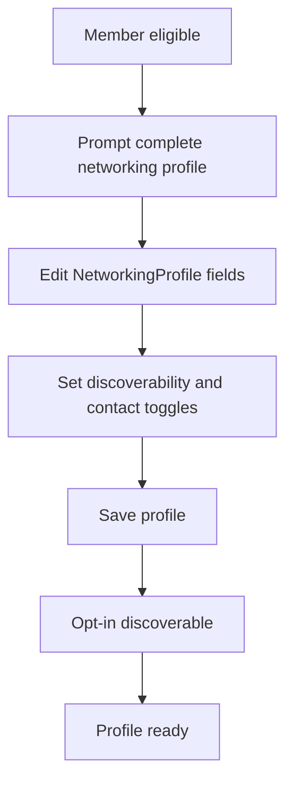
```mermaid
flowchart TD
  startNode[Member eligible] --> nudge[Prompt complete networking profile]
  nudge --> edit[Edit NetworkingProfile fields]
  edit --> privacy[Set discoverability and contact toggles]
  privacy --> save[Save profile]
  save --> optional[Opt-in discoverable]
  optional --> done[Profile ready]
```

### 64.2 Profile completion

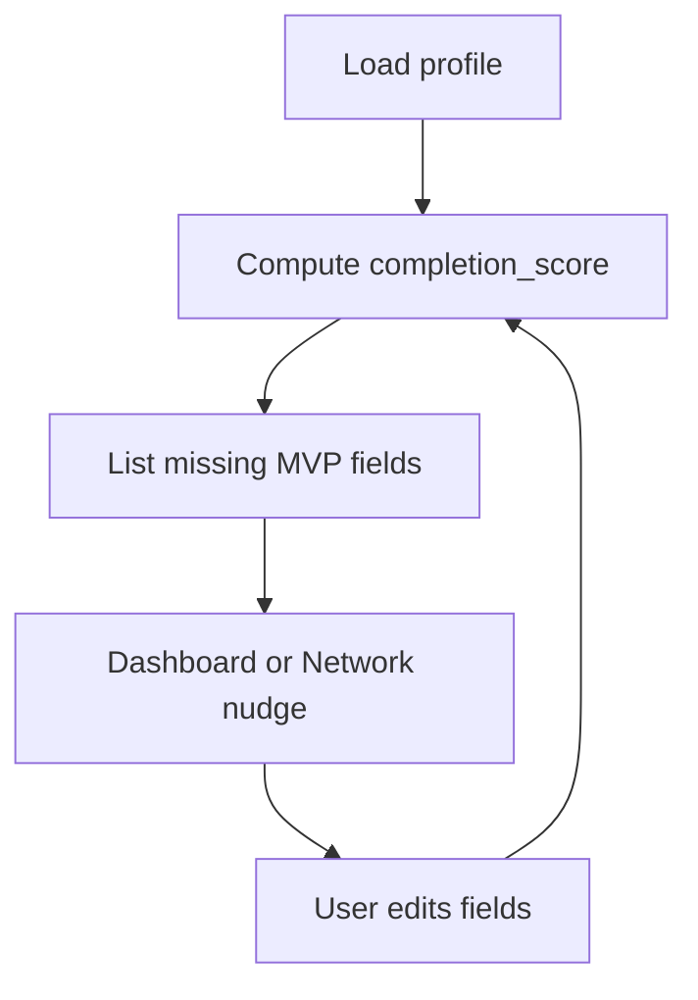
```mermaid
flowchart TD
  load[Load profile] --> score[Compute completion_score]
  score --> missing[List missing MVP fields]
  missing --> nudgeUI[Dashboard or Network nudge]
  nudgeUI --> edit[User edits fields]
  edit --> score
```

### 64.3 Profile visibility

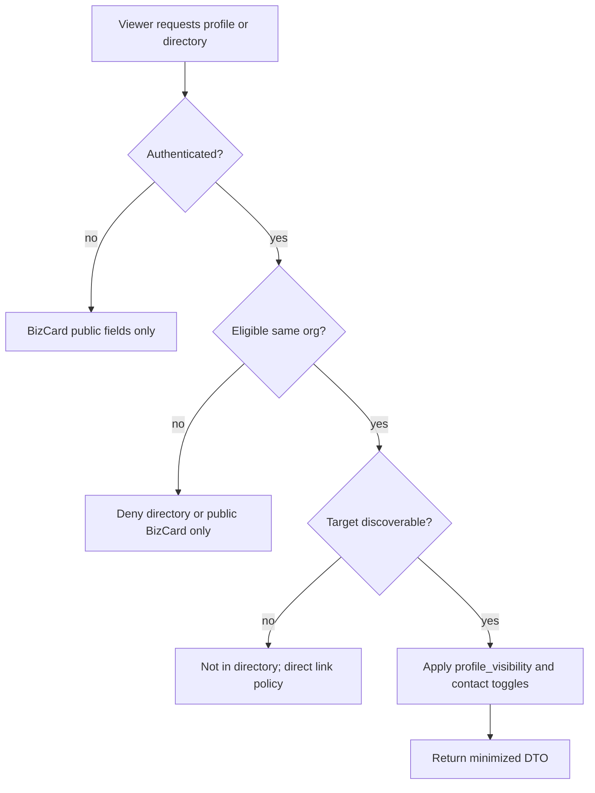
```mermaid
flowchart TD
  req[Viewer requests profile or directory] --> auth{Authenticated?}
  auth -->|no| publicBiz[BizCard public fields only]
  auth -->|yes| elig{Eligible same org?}
  elig -->|no| denyOrPublic[Deny directory or public BizCard only]
  elig -->|yes| disc{Target discoverable?}
  disc -->|no| limited[Not in directory; direct link policy]
  disc -->|yes| vis[Apply profile_visibility and contact toggles]
  vis --> dto[Return minimized DTO]
```

### 64.4 Member discovery

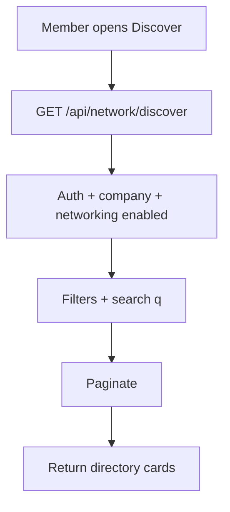
```mermaid
flowchart TD
  user[Member opens Discover] --> api[GET /api/network/discover]
  api --> gate[Auth + company + networking enabled]
  gate --> filter[Filters + search q]
  filter --> page[Paginate]
  page --> cards[Return directory cards]
```

### 64.5 Search / filter

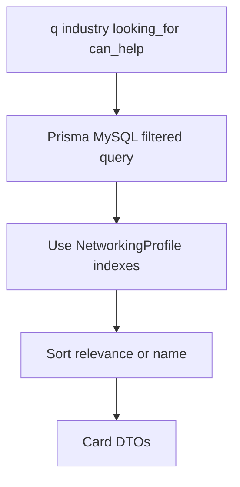
```mermaid
flowchart TD
  q[q industry looking_for can_help] --> sql[Prisma MySQL filtered query]
  sql --> idx[Use NetworkingProfile indexes]
  idx --> sort[Sort relevance or name]
  sort --> result[Card DTOs]
```

### 64.6 View profile

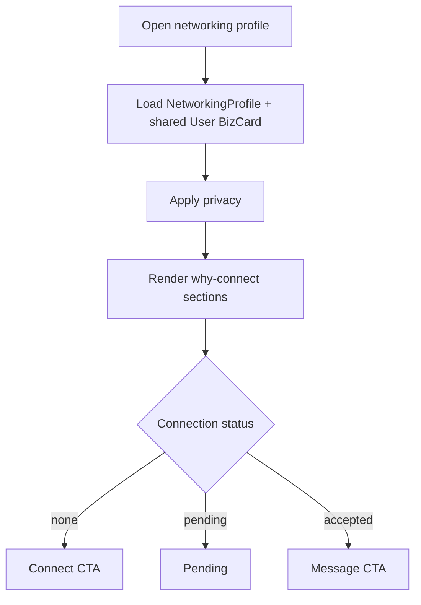
```mermaid
flowchart TD
  open[Open networking profile] --> load[Load NetworkingProfile + shared User BizCard]
  load --> privacy[Apply privacy]
  privacy --> ui[Render why-connect sections]
  ui --> cta{Connection status}
  cta -->|none| connect[Connect CTA]
  cta -->|pending| wait[Pending]
  cta -->|accepted| msg[Message CTA]
```

### 64.7 Connection request

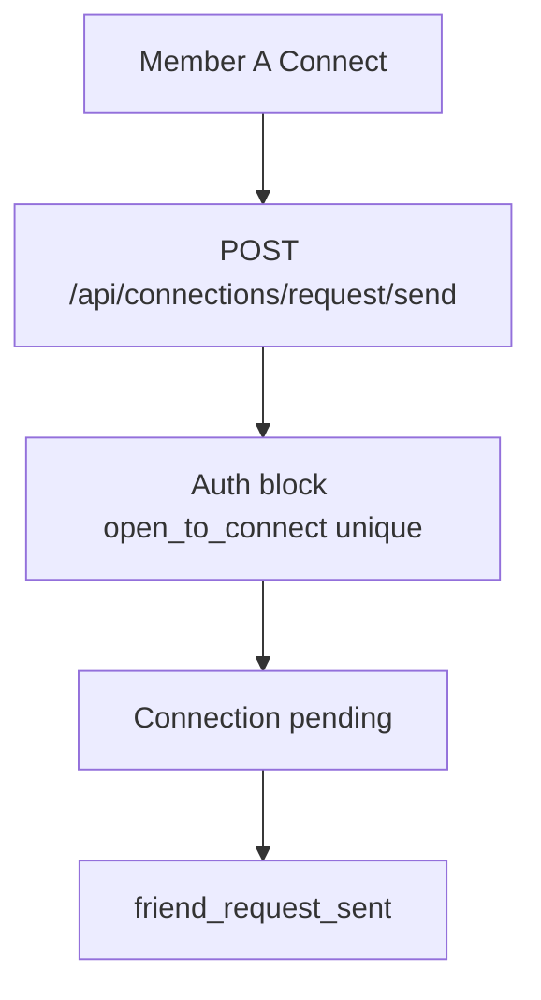
```mermaid
flowchart TD
  a[Member A Connect] --> api[POST /api/connections/request/send]
  api --> checks[Auth block open_to_connect unique]
  checks --> pending[Connection pending]
  pending --> notify[friend_request_sent]
```

### 64.8 Connection acceptance

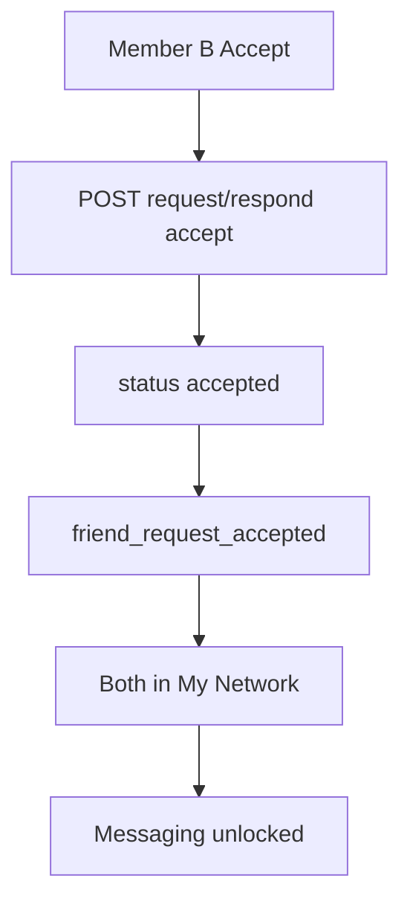
```mermaid
flowchart TD
  b[Member B Accept] --> respond[POST request/respond accept]
  respond --> accepted[status accepted]
  accepted --> notifyA[friend_request_accepted]
  notifyA --> network[Both in My Network]
  network --> msgOk[Messaging unlocked]
```

### 64.9 Connection rejection

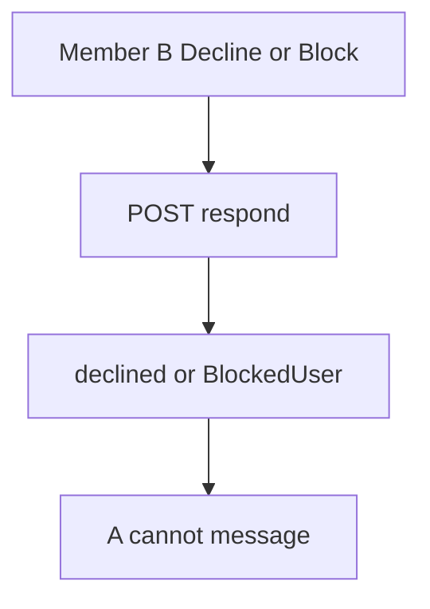
```mermaid
flowchart TD
  b[Member B Decline or Block] --> respond[POST respond]
  respond --> decline[declined or BlockedUser]
  decline --> endNode[A cannot message]
```

### 64.10 My Network

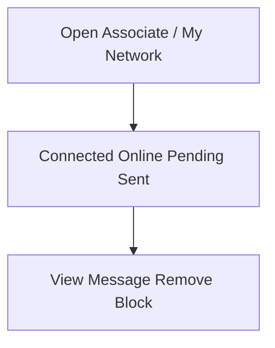
```mermaid
flowchart TD
  openNet[Open Associate / My Network] --> tabs[Connected Online Pending Sent]
  tabs --> actions[View Message Remove Block]
```

### 64.11 NFC networking

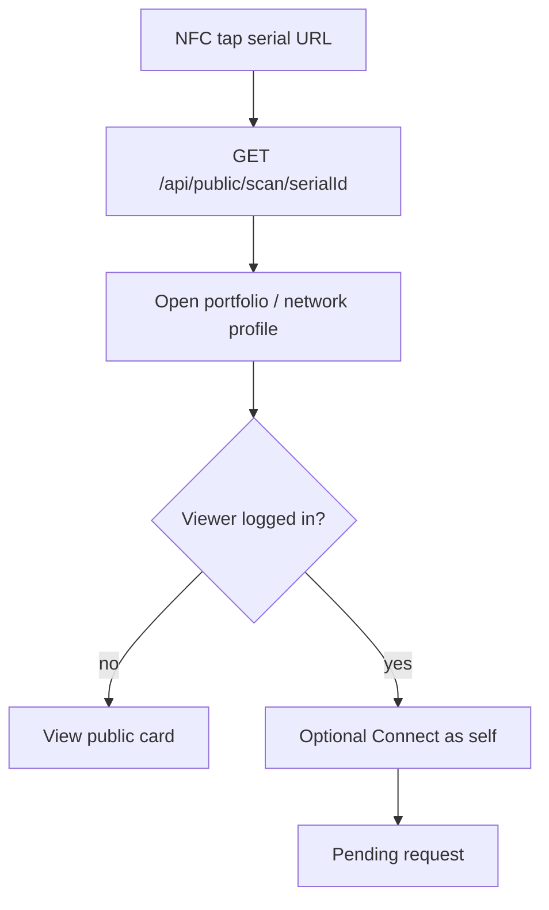
```mermaid
flowchart TD
  tap[NFC tap serial URL] --> scan[GET /api/public/scan/serialId]
  scan --> portfolio[Open portfolio / network profile]
  portfolio --> auth{Viewer logged in?}
  auth -->|no| viewPublic[View public card]
  auth -->|yes| connect[Optional Connect as self]
  connect --> pending[Pending request]
```

### 64.12 QR networking

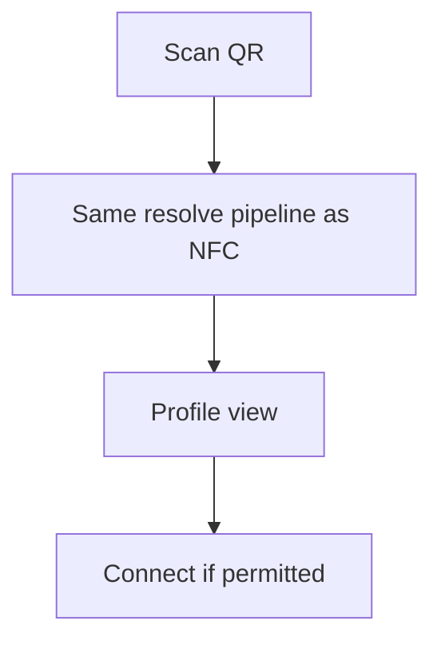
```mermaid
flowchart TD
  scanQR[Scan QR] --> same[Same resolve pipeline as NFC]
  same --> profile[Profile view]
  profile --> connect[Connect if permitted]
```

### 64.13 Profile sharing

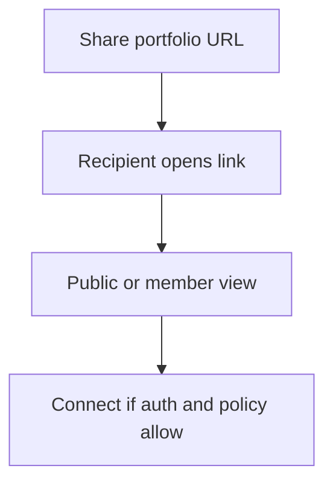
```mermaid
flowchart TD
  share[Share portfolio URL] --> recip[Recipient opens link]
  recip --> view[Public or member view]
  view --> connect[Connect if auth and policy allow]
```

### 64.14 Event networking

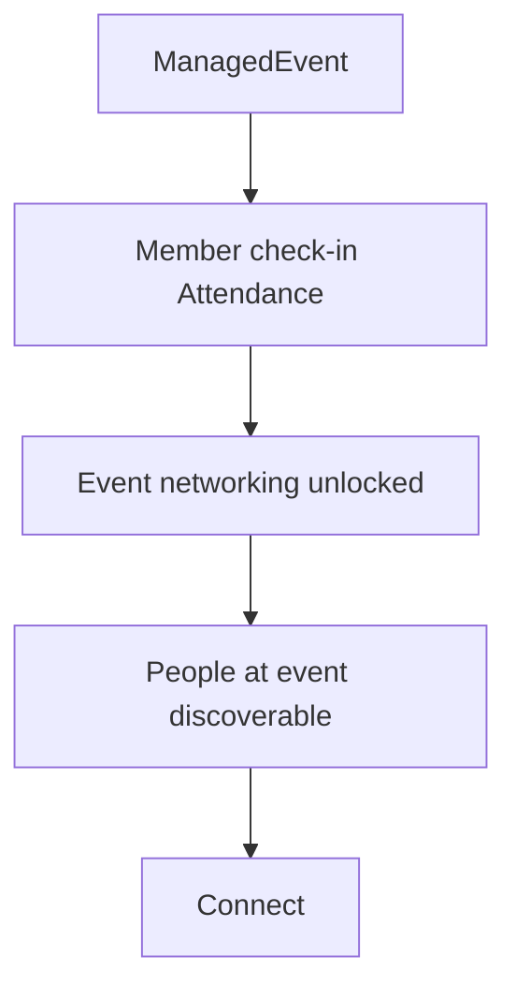
```mermaid
flowchart TD
  event[ManagedEvent] --> checkin[Member check-in Attendance]
  checkin --> unlock[Event networking unlocked]
  unlock --> list[People at event discoverable]
  list --> connect[Connect]
```

### 64.15 Attendance → Event Networking

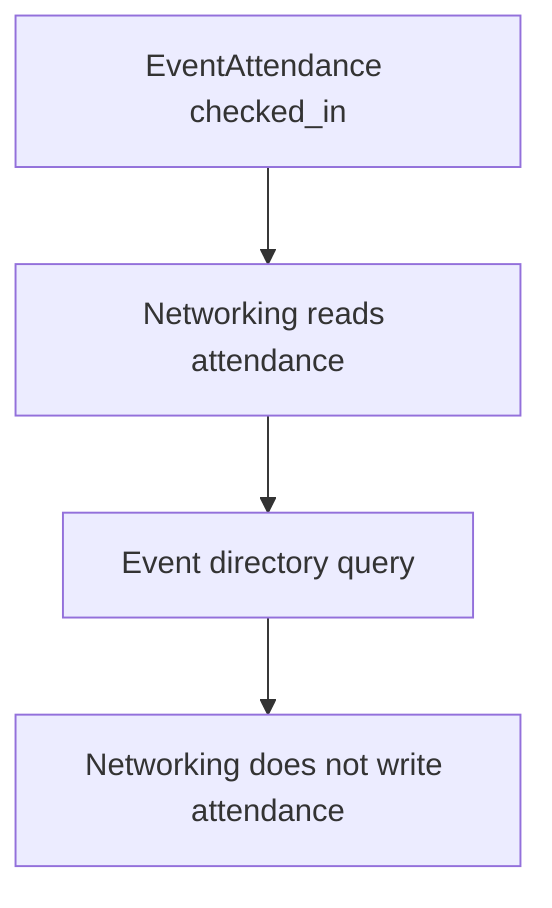
```mermaid
flowchart TD
  att[EventAttendance checked_in] --> read[Networking reads attendance]
  read --> dir[Event directory query]
  dir --> noWrite[Networking does not write attendance]
```

### 64.16 Membership → Networking eligibility

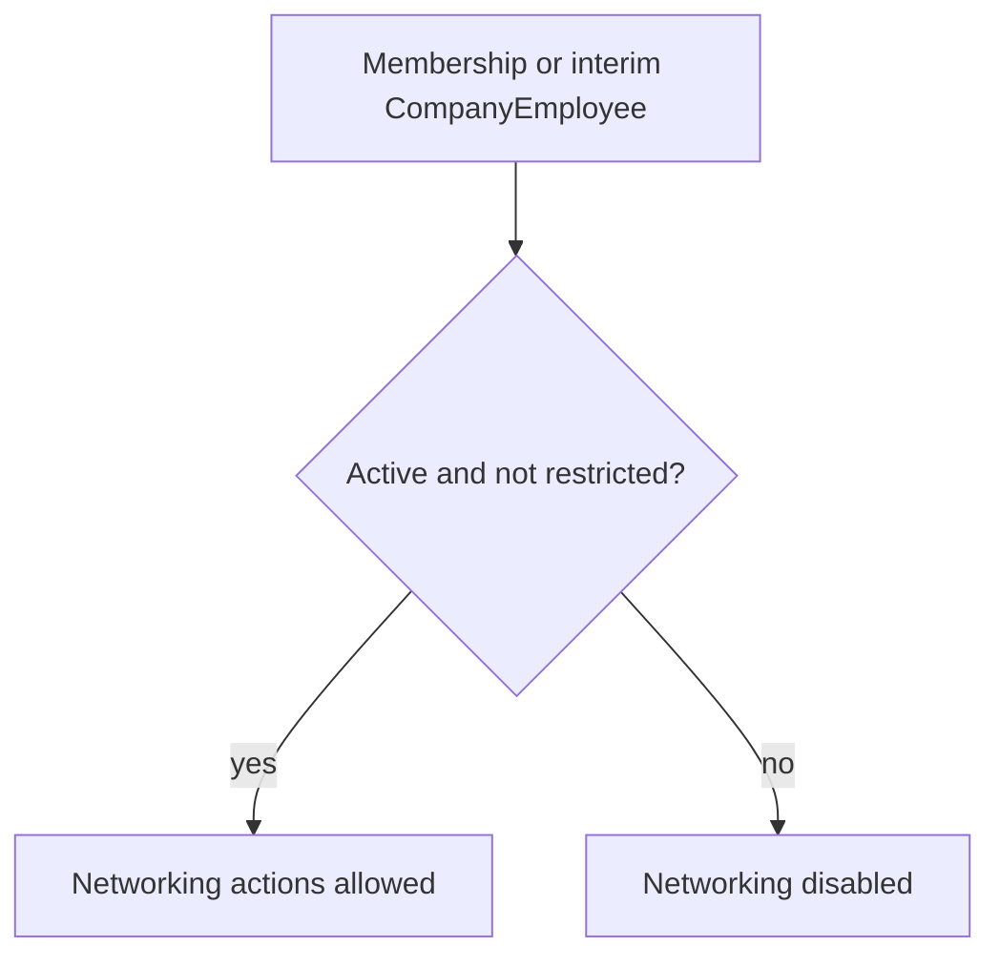
```mermaid
flowchart TD
  mem[Membership or interim CompanyEmployee] --> active{Active and not restricted?}
  active -->|yes| netOn[Networking actions allowed]
  active -->|no| netOff[Networking disabled]
```

### 64.17 Membership expiration → Networking access

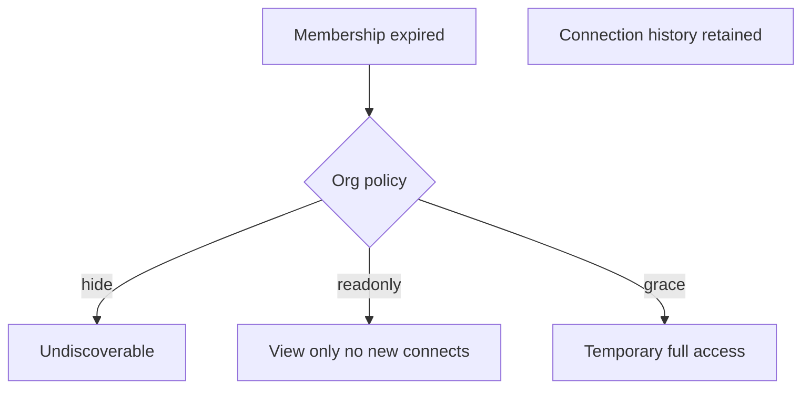
```mermaid
flowchart TD
  exp[Membership expired] --> policy{Org policy}
  policy -->|hide| hide[Undiscoverable]
  policy -->|readonly| ro[View only no new connects]
  policy -->|grace| grace[Temporary full access]
  hist[Connection history retained]
```

### 64.18 Messaging integration

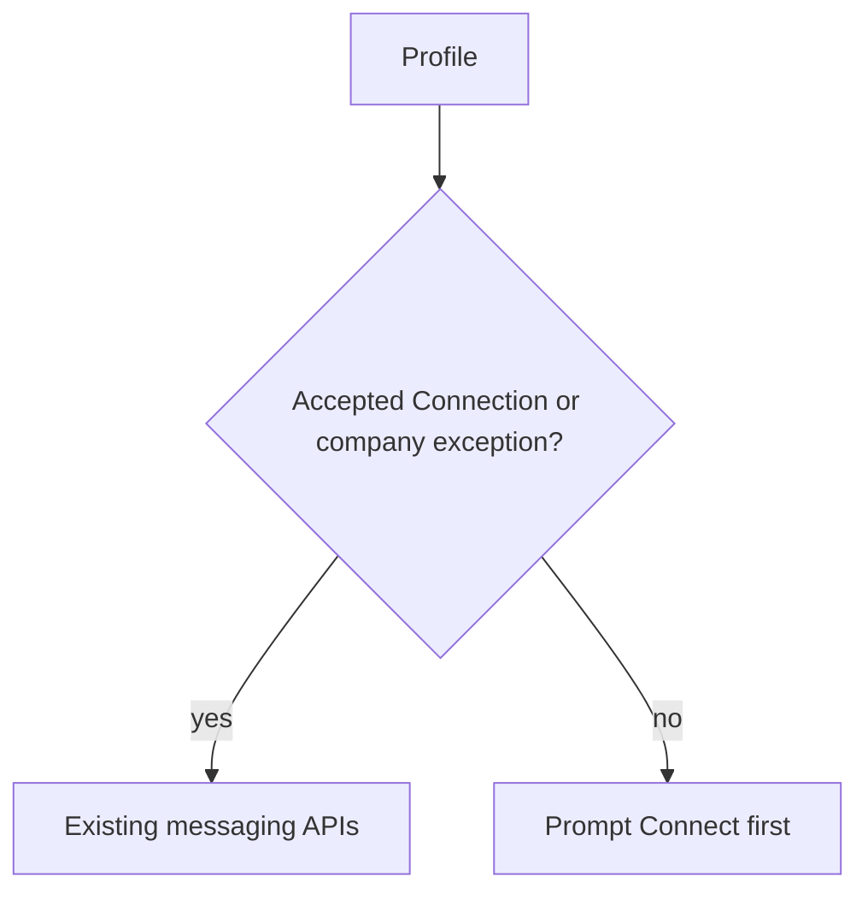
```mermaid
flowchart TD
  profile[Profile] --> need{Accepted Connection or company exception?}
  need -->|yes| dm[Existing messaging APIs]
  need -->|no| mustConnect[Prompt Connect first]
```

### 64.19 Block / report

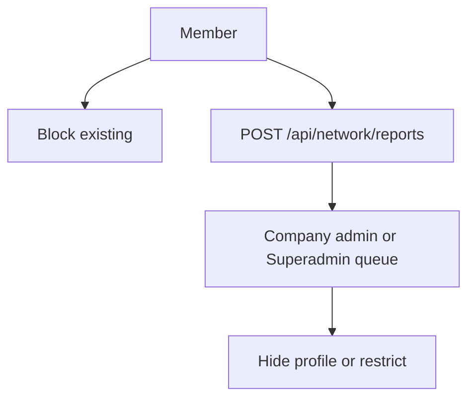
```mermaid
flowchart TD
  user[Member] --> block[Block existing]
  user --> report[POST /api/network/reports]
  report --> queue[Company admin or Superadmin queue]
  queue --> action[Hide profile or restrict]
```

### 64.20 Networking → Loyalty / Missions

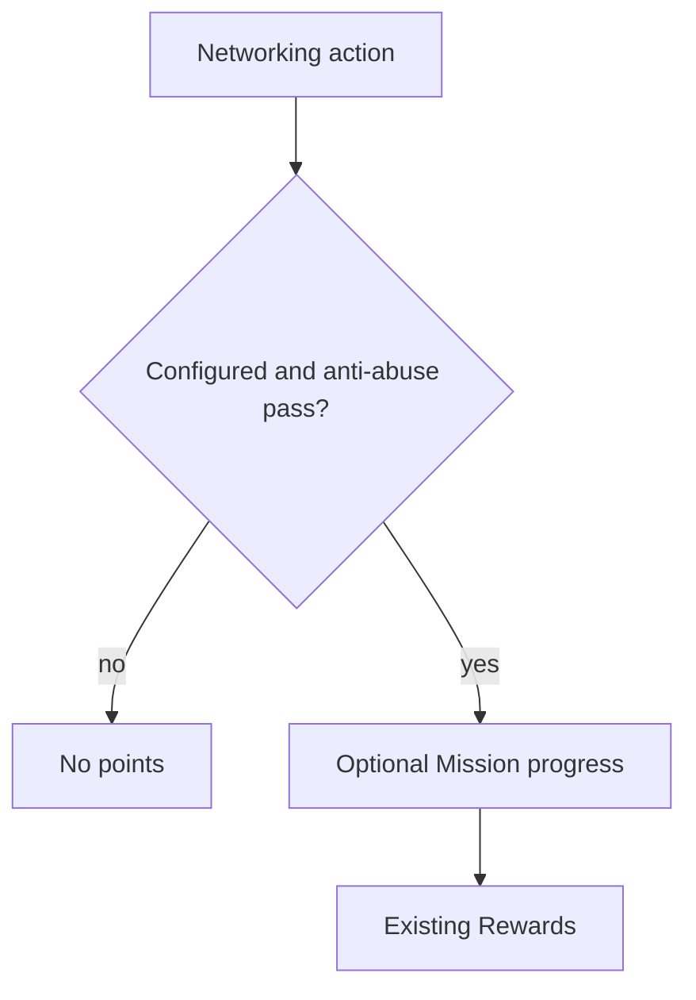
```mermaid
flowchart TD
  act[Networking action] --> qualify{Configured and anti-abuse pass?}
  qualify -->|no| none[No points]
  qualify -->|yes| mission[Optional Mission progress]
  mission --> reward[Existing Rewards]
```

### 64.21 Organization networking

```mermaid
flowchart TD
  admin[Company admin] --> enable[Enable networking module]
  enable --> members[Members opt-in discoverable]
  members --> directory[Org-private directory]
```

### 64.22 Cross-organization concept

```mermaid
flowchart TD
  mvp[MVP org-only directory] --> future[Phase2 member opt-in scope]
  future --> global[Optional global discoverable pool]
```

### 64.23 Full TAP networking ecosystem

```mermaid
flowchart TD
  membership[Membership / Company] --> identity[Member Identity]
  identity --> credential[NFC_QR Credential]
  credential --> biz[Digital BizCard]
  biz --> netProf[NetworkingProfile]
  netProf --> discover[Discovery]
  discover --> conn[Connection Associates]
  conn --> msg[Messaging]
  msg --> events[Event Networking]
  events --> engage[Member Engagement]
  engage --> loyalty[Missions Loyalty Rewards optional]
```

---

## 65. System Integration Map

| System | Owns | Networking consumes / extends |
|---|---|---|
| Membership (future) / CompanyEmployee (today) | Who is a member | Eligibility |
| Member Identity (User) | Auth person | Actor for all actions |
| NFC / QR | Credential resolve | Open profile entry |
| BizCard | Public professional identity | Face of networking |
| NetworkingProfile | Intent + privacy | Directory relevance |
| Discovery | Search/list | Feeds Connect |
| Connection | Trust graph | Associates |
| Messaging | Follow-up chat | After accept |
| Events / Attendance | Participation | Event directories |
| Notifications | Delivery | Request/accept/DM |
| Missions / Loyalty | Rewards | Optional qualified hooks only |

---

## 66. MVP vs Future

### MVP

- Useful networking profiles  
- Org-scoped discovery + search  
- Connection via existing Associates  
- NFC/QR → profile → connect  
- Privacy + security basics  
- Messaging reuse  
- Event networking **hooks** (full list when Attendance ready)

### Phase 2

- Connection request notes  
- Stronger recommendations  
- Event networking UX polish  
- Org custom intent catalogs  
- Report admin UX  
- Member-choice cross-org scope  

### Future

- AI / proximity / CRM / reputation / global discovery / advanced monetization analytics  

---

## 67. File Impact Analysis

### 67.1 Existing files likely relevant

| Path | Purpose | Why relevant |
|---|---|---|
| `prisma/schema.prisma` | Models | Connection, Bizcard, User, messaging |
| `app/components/AssociateUser.tsx` | Associates UI | Evolve to My Network |
| `server/lib/connections.ts` | Connection helpers | Mutuals, cache, session |
| `app/api/connections/**` | Connection APIs | Keep as engine |
| `lib/services/connection-messaging.service.ts` | DM rules | Message CTA gating |
| `app/components/messaging/**` | Messenger UI | Follow-up UX |
| `app/[alias]/AliasPageClient.tsx` | Public portfolio | Connect + share entry |
| `app/api/portfolio/[uri]/**` | Portfolio APIs | Connect, social proof |
| `app/api/public/scan/[serialId]/route.ts` | NFC/QR resolve | Identity entry |
| `lib/bizcard/scan-routing.ts` | Scan routing | Future context hooks |
| `app/config/portalNavigation.ts` | Nav | Network group |
| `server/lib/notifications.ts` | Notifications | Reuse event types |
| `app/components/digital-card/**` | Digital BizCard | Share/QR |
| `app/user/dashboard/**` / `DashboardContent.tsx` | Dashboard | Nudges/widgets |
| `docs/FEATURE_INTEGRATION_RECOMMENDATIONS.md` | Roadmap | §5.5 alignment |
| `docs/Attendance & Event Monitoring.md` | Attendance SoT | Event networking |

### 67.2 Existing files that could be extended

| Path | Current | Extension |
|---|---|---|
| `AssociateUser.tsx` | Lists/requests | Relevance fields, Discover entry |
| `connections/suggestions/route.ts` | Naïve newest users | Deterministic networking rules |
| `portalNavigation.ts` | Associate item | Network group |
| Portfolio connect UI | Connect button | Why-connect snippet |
| Company admin settings | Company perms | Networking enable + policy |
| Missions catalog (superadmin) | Growth missions | Optional networking missions |

### 67.3 New files likely needed later (do not create now)

| Path | Purpose |
|---|---|
| `app/user/network/**` | Discover / profile pages |
| `app/components/network/**` | Directory cards, profile editor |
| `app/api/network/**` | Profile, discover, reports |
| `lib/services/networking-profile.service.ts` | Domain logic |
| `lib/services/network-discover.service.ts` | Search |
| Prisma migrations for `NetworkingProfile`, reports | Schema |
| Company network settings UI | Org policy |

### 67.4 Files that should NOT be touched (for this feature)

- E-market / merchandise checkout (except unrelated)  
- Xendit payment internals  
- Affiliate commission engine (except mission hooks later)  
- Spin/roulette  
- Dev portal incident tooling  
- Unrelated staff order PDF pipelines  

---

## 68. Implementation Order

| Phase | Focus |
|---|---|
| 1 | NetworkingProfile foundation + edit UI |
| 2 | Privacy / discoverability enforcement |
| 3 | Member directory / search APIs + UI |
| 4 | Wire directory → existing Connection APIs; upgrade suggestions |
| 5 | NFC/QR entry CTAs consistency (no auto-connect) |
| 6 | Messaging CTA alignment on networking profiles |
| 7 | Event networking (after Attendance MVP) |
| 8 | Reports / moderation / rate-limit hardening |
| 9 | Org/platform aggregate analytics |
| 10 | Optional Missions / loyalty policy hooks |

**Do not implement in this documentation phase.**

---

## 69. Testing Strategy

| Layer | Focus |
|---|---|
| Unit | Privacy serializers, completion score, match rules |
| Integration | Profile CRUD + discover filters |
| API | Authz on `/api/network/*`; connections unchanged contracts |
| Authorization | Cross-company deny; hidden users excluded |
| Privacy | Email/phone never leak on cards |
| Search | Pagination caps, indexes smoke |
| Connection | Idempotent send; unique pair |
| Concurrency | Dual-request race; block vs request |
| Idempotency | Double accept; repeat scan |
| NFC/QR | Resolve opens profile; no auto edge |
| Event networking | Requires check-in server-side |
| Membership expiry | Gates actions; keeps history |
| Abuse | Rate limit 429s; report dedupe |
| Regression | Associate list, messaging assertCanMessage, portfolio connect |

### Critical scenarios

1. Hidden member never appears in discover  
2. Non-company user cannot list company directory  
3. Connect from directory creates same `Connection` as portfolio connect  
4. Message blocked until accept  
5. NFC tap by anonymous user cannot connect as someone else  
6. Checked-out member disappears from event list  
7. Blocked user cannot request again  

---

## 70. Open Business Questions

1. Should networking be limited to members of the same organization? *(Doc MVP assumes yes.)*  
2. Should members be discoverable across organizations?  
3. Should expired members remain visible?  
4. Should members be able to hide their profile? *(Doc recommends yes.)*  
5. Should networking require an accepted connection before messaging? *(Code today: yes for peers.)*  
6. Should event attendees automatically become discoverable to each other? *(Doc: only if discoverable + checked-in.)*  
7. Should members be able to see mutual connections lists or only counts?  
8. Should profile views list individual viewers? *(Doc: no for MVP.)*  
9. Should connection requests include a message? *(Doc: Phase 2.)*  
10. Should networking actions generate loyalty points? *(Doc: not by default.)*  
11. Should members be able to export contacts (VCF) from networking?  
12. Who can moderate networking profiles — company admin, staff, and/or Superadmin?  
13. Can organization admins disable networking entirely? *(Doc: yes.)*  
14. What member information should be publicly visible without login?  
15. Should NFC tapping open BizCard, networking profile, or a combined view?  
16. Should event networking only be available to checked-in members? *(Doc: yes.)*  
17. Should TAP eventually support global member discovery?  
18. Default discoverable opt-in vs opt-out? *(Doc leans opt-in for privacy.)*  
19. Rename nav “Associate” → “Network” or keep brand “Associate”?  
20. Interim eligibility without Membership domain: require `CompanyEmployee` only, or also solo BizCard subscribers?

**Do not invent answers beyond the documented MVP defaults.**

---

## 71. Final Architecture Recommendation

Networking Profiles should fit TAP as follows:

```text
MEMBERSHIP (future) / Company affiliation (today)
    ↓
MEMBER IDENTITY (User)
    ↓
NFC / QR CREDENTIAL (serial → resolve)
    ↓
DIGITAL PROFILE / BIZCARD (public face)
    ↓
NETWORKING PROFILE (intent + privacy) [PROPOSED]
    ↓
DISCOVERY (org directory) [PROPOSED]
    ↓
CONNECTIONS (Associates / Connection) [EXISTING]
    ↓
MESSAGING [EXISTING]
    ↓
EVENT NETWORKING (consumes Attendance) [PROPOSED]
    ↓
MEMBER ENGAGEMENT
    ↓
LOYALTY / MISSIONS / REWARDS (optional, anti-abuse) [EXISTING hooks]
```

### Clarity of ownership

| Concern | Owner |
|---|---|
| NFC/QR identifies | Scan + BizCard serial |
| Membership establishes eligibility | Membership / CompanyEmployee |
| Networking creates relationships | NetworkingProfile + Discovery + **existing Connection** |
| Attendance establishes participation | Attendance domain |
| Messaging enables follow-up | Existing Direct* messaging |
| Loyalty rewards qualifying engagement | Only when explicitly configured |

**Do not replace Associates. Do not replace BizCard. Add the missing discovery + intent + privacy layer, then plug into the trust graph TAP already has.**

---

## 72. Closing Summary

1. **Documentation created:** `docs/Networking Profiles for Members.md` (architecture only; no code changed).  
2. **Existing networking/profile functionality discovered:** Associates (`Connection`), BizCard/portfolio public identity, connection-gated messaging, NFC/QR serial resolve, notifications for requests/DMs/views, naïve suggestions, contact save / profile views analytics.  
3. **Proposed Networking Profile architecture:** Separate `NetworkingProfile` layer referencing BizCard; Membership/Company for eligibility.  
4. **Discovery architecture:** Same-company directory, Prisma/MySQL filters, minimized cards, opt-in discoverability.  
5. **Connection architecture:** Extend existing Associates APIs — no second graph.  
6. **NFC/QR integration:** Identify → open profile → optional Connect; never auto-connect.  
7. **Event networking integration:** Consume Attendance check-in; show checked-in + discoverable members.  
8. **Membership integration:** Consume eligibility; retain connection history on expiry; interim CompanyEmployee + active User.  
9. **Messaging integration:** Reuse Direct messaging; require accepted connection (existing rules).  
10. **Security/privacy model:** Org boundary, discoverability, field minimization, rate limits, block/report, no privileged grant via public links.  
11. **MVP recommendation:** Profile + privacy + org discovery + existing connect/message + NFC/QR entry; event list after Attendance.  
12. **Future opportunities:** AI match, cross-org opt-in, analytics depth, CRM, reputation, monetized org networking module.  
13. **Open business decisions:** See §70 (org scope, expiry visibility, mutuals, loyalty, nav naming, opt-in default, etc.).

---

**Status:** Discovery complete. **No application code, schema, APIs, UI, packages, env, or migrations were changed** in producing this document.
