# Networking Profiles for Members — Mermaid Architecture

**Companion to:** [`docs/Networking Profiles for Members.md`](../Networking%20Profiles%20for%20Members.md)  
**Document type:** Visual architecture / flowcharts only  
**Status:** Discovery visualization — **no implementation**  
**Date:** September 7, 2026  
**Related:** [`Attendance & Event Monitoring — Mermaid Architecture.md`](../attendance-flowcharts/Attendance%20%26%20Event%20Monitoring%20%E2%80%94%20Mermaid%20Architecture.md)

This file contains **Mermaid source** for the Networking Profiles for Members concept. Render in any Mermaid-compatible viewer (GitHub, VS Code Mermaid preview, etc.). No exported images.

---

## Table of Contents

1. [System at a Glance](#1-system-at-a-glance)
2. [Product Vision — Directory vs Networking](#2-product-vision--directory-vs-networking)
3. [Today vs Target](#3-today-vs-target)
4. [Locked Architecture Stack](#4-locked-architecture-stack)
5. [Profile Source of Truth](#5-profile-source-of-truth)
6. [Member Networking Profile Fields](#6-member-networking-profile-fields)
7. [Profile Visibility & Privacy](#7-profile-visibility--privacy)
8. [Profile Creation & Completion](#8-profile-creation--completion)
9. [Member Discovery](#9-member-discovery)
10. [Search Architecture](#10-search-architecture)
11. [Directory Card → Profile View](#11-directory-card--profile-view)
12. [Connection Lifecycle](#12-connection-lifecycle)
13. [My Network](#13-my-network)
14. [Messaging Integration](#14-messaging-integration)
15. [NFC Networking Flow](#15-nfc-networking-flow)
16. [QR Networking Flow](#16-qr-networking-flow)
17. [Profile Sharing](#17-profile-sharing)
18. [Event-Based Networking](#18-event-based-networking)
19. [Attendance → Event Networking](#19-attendance--event-networking)
20. [Recommendations & Why Connect](#20-recommendations--why-connect)
21. [Networking Intent](#21-networking-intent)
22. [Block / Report / Moderation](#22-block--report--moderation)
23. [Roles — Staff / Superadmin / Org Admin](#23-roles--staff--superadmin--org-admin)
24. [Cross-Organization Architecture](#24-cross-organization-architecture)
25. [Membership Eligibility](#25-membership-eligibility)
26. [NFC / QR Identity Security](#26-nfc--qr-identity-security)
27. [Connection Security & Concurrency](#27-connection-security--concurrency)
28. [Fraud / Abuse Map](#28-fraud--abuse-map)
29. [Conceptual Data Model](#29-conceptual-data-model)
30. [API Surface Map](#30-api-surface-map)
31. [System Integration Map](#31-system-integration-map)
32. [Loyalty / Missions Hooks](#32-loyalty--missions-hooks)
33. [Navigation IA](#33-navigation-ia)
34. [MVP vs Future](#34-mvp-vs-future)
35. [Implementation Order](#35-implementation-order)
36. [End-to-End Whole Flow](#36-end-to-end-whole-flow)

---

## Label legend

| Label | Meaning |
|---|---|
| **[VERIFIED EXISTING]** | Confirmed in current TAP codebase |
| **[PROPOSED]** | Recommended future architecture |
| **[SHARED]** | Owned by another domain; networking consumes it |
| **[FUTURE PHASE]** | Explicitly deferred |

---

## 1. System at a Glance

**[PROPOSED]** Professional member networking layer inside TAP — not a passive directory dump. References BizCard, extends Associates, does **not** replace either.

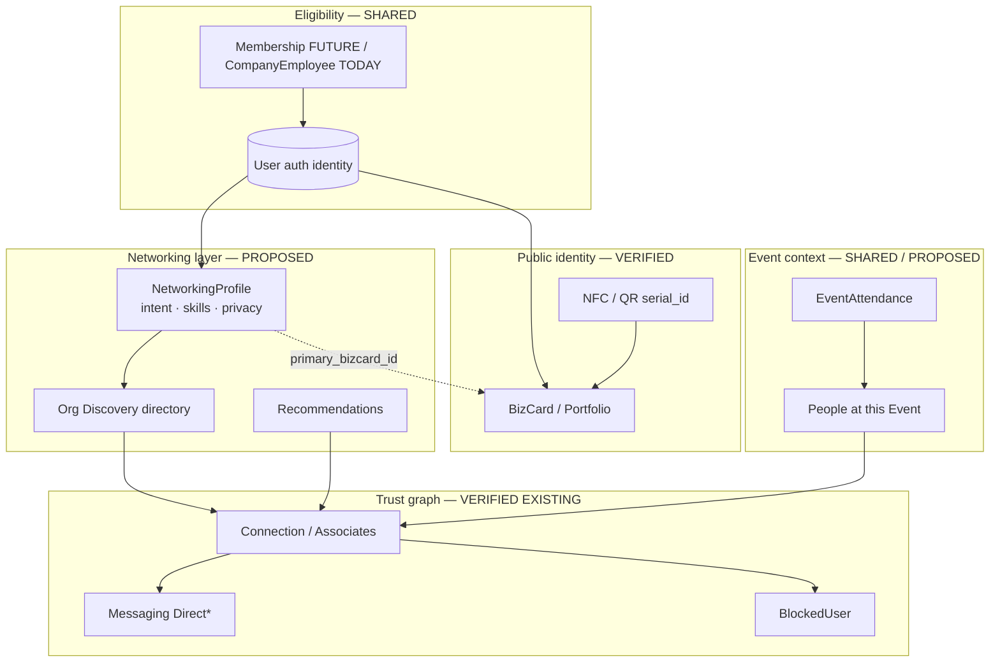
```mermaid
flowchart TB
  subgraph Eligibility["Eligibility — SHARED"]
    Mem[Membership FUTURE / CompanyEmployee TODAY]
    User[(User auth identity)]
  end

  subgraph Identity["Public identity — VERIFIED"]
    Biz[BizCard / Portfolio]
    Serial[NFC / QR serial_id]
  end

  subgraph Networking["Networking layer — PROPOSED"]
    NP[NetworkingProfile<br/>intent · skills · privacy]
    Disc[Org Discovery directory]
    Rec[Recommendations]
  end

  subgraph Graph["Trust graph — VERIFIED EXISTING"]
    Conn[Connection / Associates]
    Msg[Messaging Direct*]
    Block[BlockedUser]
  end

  subgraph Events["Event context — SHARED / PROPOSED"]
    Att[EventAttendance]
    EvNet[People at this Event]
  end

  Mem --> User
  User --> Biz
  User --> NP
  Serial --> Biz
  NP --> Disc
  Disc --> Conn
  Rec --> Conn
  Conn --> Msg
  Conn --> Block
  Att --> EvNet
  EvNet --> Conn
  NP -.->|primary_bizcard_id| Biz
```

---

## 2. Product Vision — Directory vs Networking

Directory alone is insufficient; Networking creates relationships.

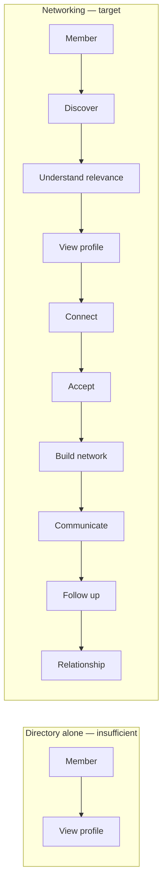
```mermaid
flowchart LR
  subgraph Dir["Directory alone — insufficient"]
    D1[Member] --> D2[View profile]
  end

  subgraph Net["Networking — target"]
    N1[Member] --> N2[Discover]
    N2 --> N3[Understand relevance]
    N3 --> N4[View profile]
    N4 --> N5[Connect]
    N5 --> N6[Accept]
    N6 --> N7[Build network]
    N7 --> N8[Communicate]
    N8 --> N9[Follow up]
    N9 --> N10[Relationship]
  end
```

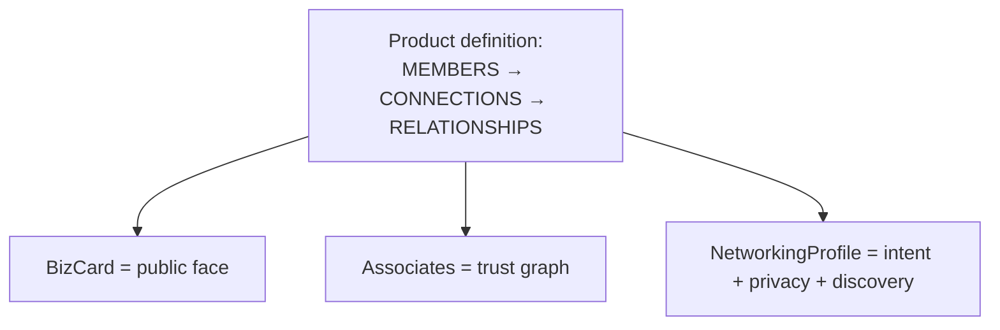
```mermaid
flowchart TD
  DEF["Product definition:<br/>MEMBERS → CONNECTIONS → RELATIONSHIPS"]
  DEF --> FACE[BizCard = public face]
  DEF --> GRAPH[Associates = trust graph]
  DEF --> LAYER[NetworkingProfile = intent + privacy + discovery]
```

---

## 3. Today vs Target

What TAP already has vs what Networking MVP adds.

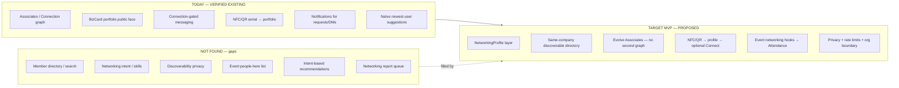
```mermaid
flowchart LR
  subgraph Today["TODAY — VERIFIED EXISTING"]
    T1[Associates / Connection graph]
    T2[BizCard portfolio public face]
    T3[Connection-gated messaging]
    T4[NFC/QR serial → portfolio]
    T5[Notifications for requests/DMs]
    T6[Naïve newest-user suggestions]
  end

  subgraph Gap["NOT FOUND — gaps"]
    G1[Member directory / search]
    G2[Networking intent / skills]
    G3[Discoverability privacy]
    G4[Event people-here list]
    G5[Intent-based recommendations]
    G6[Networking report queue]
  end

  subgraph Target["TARGET MVP — PROPOSED"]
    M1[NetworkingProfile layer]
    M2[Same-company discoverable directory]
    M3[Evolve Associates — no second graph]
    M4[NFC/QR → profile → optional Connect]
    M5[Event networking hooks → Attendance]
    M6[Privacy + rate limits + org boundary]
  end

  Today --> Target
  Gap -.->|filled by| Target
```

---

## 4. Locked Architecture Stack

Chosen stack (FEATURE_INTEGRATION §5.5 Option A / product Option C).

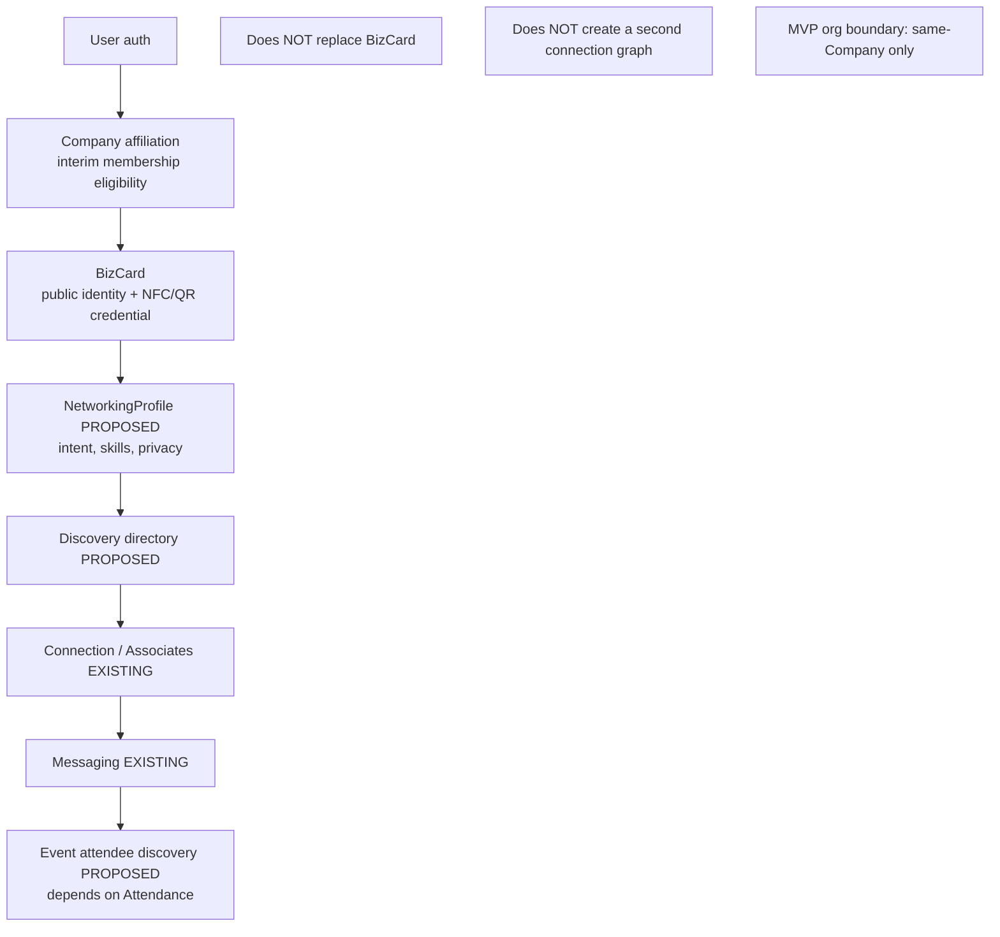
```mermaid
flowchart TD
  U[User auth] --> CO[Company affiliation<br/>interim membership eligibility]
  CO --> BC[BizCard<br/>public identity + NFC/QR credential]
  BC --> NP[NetworkingProfile PROPOSED<br/>intent, skills, privacy]
  NP --> DIR[Discovery directory PROPOSED]
  DIR --> CON[Connection / Associates EXISTING]
  CON --> MSG[Messaging EXISTING]
  MSG --> EV[Event attendee discovery PROPOSED<br/>depends on Attendance]

  note1[Does NOT replace BizCard]
  note2[Does NOT create a second connection graph]
  note3[MVP org boundary: same-Company only]
```

---

## 5. Profile Source of Truth

Ownership matrix — Networking owns intent/privacy only.

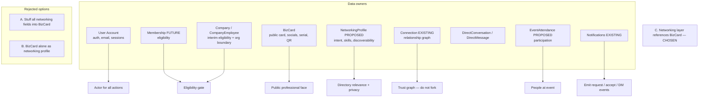
```mermaid
flowchart TD
  subgraph Owners["Data owners"]
    UA[User Account<br/>auth, email, sessions]
    MEM[Membership FUTURE<br/>eligibility]
    CE[Company / CompanyEmployee<br/>interim eligibility + org boundary]
    BC[BizCard<br/>public card, socials, serial, QR]
    NP[NetworkingProfile PROPOSED<br/>intent, skills, discoverability]
    CN[Connection EXISTING<br/>relationship graph]
    DM[DirectConversation / DirectMessage]
    EA[EventAttendance PROPOSED<br/>participation]
    NT[Notifications EXISTING]
  end

  UA --> Actor[Actor for all actions]
  MEM --> Elig[Eligibility gate]
  CE --> Elig
  BC --> Face[Public professional face]
  NP --> Intent[Directory relevance + privacy]
  CN --> Trust[Trust graph — do not fork]
  EA --> People[People at event]
  NT --> Emit[Emit request / accept / DM events]

  subgraph Rejected["Rejected options"]
    R1[A. Stuff all networking fields into BizCard]
    R2[B. BizCard alone as networking profile]
  end

  Chosen[C. Networking layer references BizCard — CHOSEN]
```

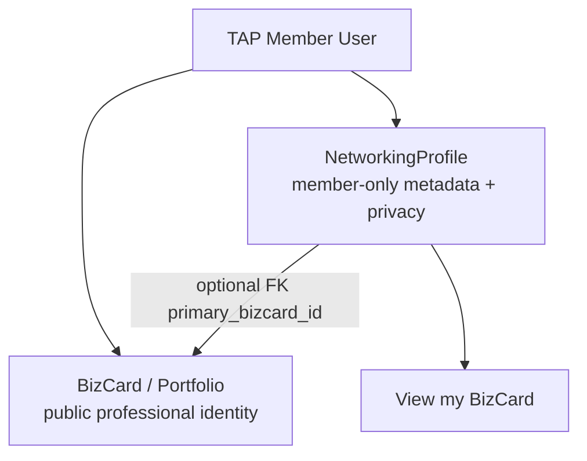
```mermaid
flowchart TD
  Member[TAP Member User]
  Member --> BizCard[BizCard / Portfolio<br/>public professional identity]
  Member --> NetProf[NetworkingProfile<br/>member-only metadata + privacy]
  NetProf -->|optional FK primary_bizcard_id| BizCard
  NetProf --> CTA[View my BizCard]
```

---

## 6. Member Networking Profile Fields

MVP field categories and sources.

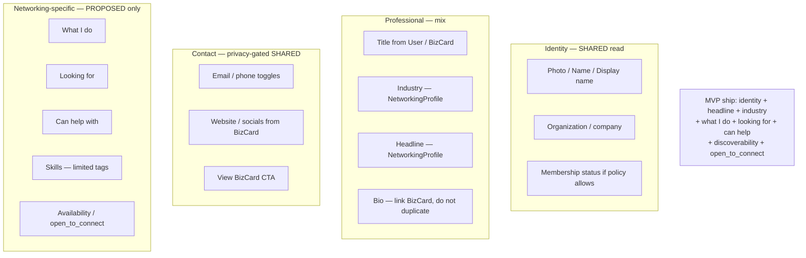
```mermaid
flowchart TB
  subgraph Identity["Identity — SHARED read"]
    I1[Photo / Name / Display name]
    I2[Organization / company]
    I3[Membership status if policy allows]
  end

  subgraph Professional["Professional — mix"]
    P1[Title from User / BizCard]
    P2[Industry — NetworkingProfile]
    P3[Headline — NetworkingProfile]
    P4[Bio — link BizCard, do not duplicate]
  end

  subgraph Contact["Contact — privacy-gated SHARED"]
    C1[Email / phone toggles]
    C2[Website / socials from BizCard]
    C3[View BizCard CTA]
  end

  subgraph NetOnly["Networking-specific — PROPOSED only"]
    N1[What I do]
    N2[Looking for]
    N3[Can help with]
    N4[Skills — limited tags]
    N5[Availability / open_to_connect]
  end

  MVP[MVP ship: identity + headline + industry<br/>+ what I do + looking for + can help<br/>+ discoverability + open_to_connect]
```

---

## 7. Profile Visibility & Privacy

Discovery and detail rules — membership alone ≠ directory listing.

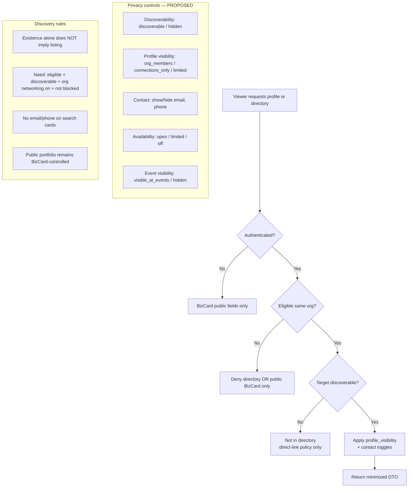
```mermaid
flowchart TD
  REQ[Viewer requests profile or directory] --> AUTH{Authenticated?}
  AUTH -->|No| PUB[BizCard public fields only]
  AUTH -->|Yes| ELIG{Eligible same org?}
  ELIG -->|No| DENY[Deny directory OR public BizCard only]
  ELIG -->|Yes| DISC{Target discoverable?}
  DISC -->|No| HIDE[Not in directory<br/>direct-link policy only]
  DISC -->|Yes| VIS[Apply profile_visibility<br/>+ contact toggles]
  VIS --> DTO[Return minimized DTO]

  subgraph Controls["Privacy controls — PROPOSED"]
    K1[Discoverability: discoverable / hidden]
    K2[Profile visibility: org_members / connections_only / limited]
    K3[Contact: show/hide email, phone]
    K4[Availability: open / limited / off]
    K5[Event visibility: visible_at_events / hidden]
  end

  subgraph Rules["Discovery rules"]
    R1[Existence alone does NOT imply listing]
    R2[Need: eligible + discoverable + org networking on + not blocked]
    R3[No email/phone on search cards]
    R4[Public portfolio remains BizCard-controlled]
  end
```

---

## 8. Profile Creation & Completion

Soft completion — non-blocking nudges.

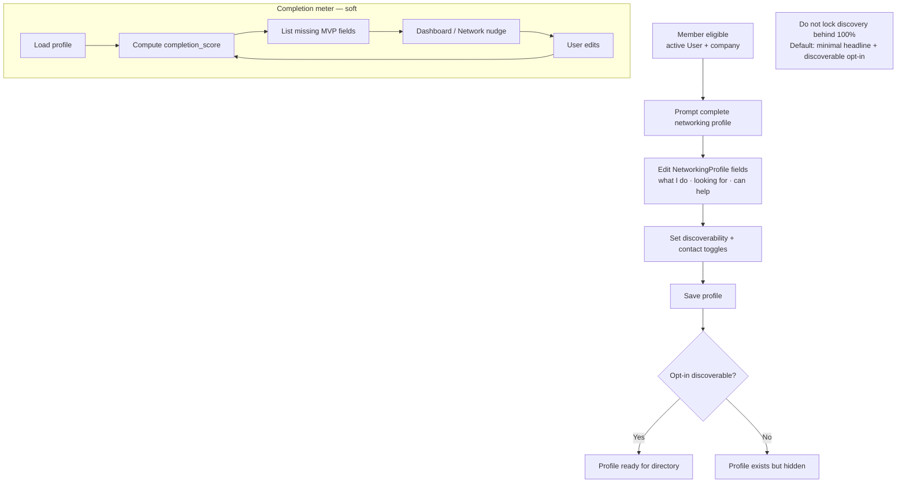
```mermaid
flowchart TD
  START[Member eligible<br/>active User + company] --> NUDGE[Prompt complete networking profile]
  NUDGE --> EDIT[Edit NetworkingProfile fields<br/>what I do · looking for · can help]
  EDIT --> PRIV[Set discoverability + contact toggles]
  PRIV --> SAVE[Save profile]
  SAVE --> OPT{Opt-in discoverable?}
  OPT -->|Yes| READY[Profile ready for directory]
  OPT -->|No| HIDDEN[Profile exists but hidden]

  subgraph Completion["Completion meter — soft"]
    L[Load profile] --> S[Compute completion_score]
    S --> M[List missing MVP fields]
    M --> UI[Dashboard / Network nudge]
    UI --> EDIT2[User edits] --> S
  end

  note1[Do not lock discovery behind 100%<br/>Default: minimal headline + discoverable opt-in]
```

---

## 9. Member Discovery

Org-scoped relevance discovery — not the entire TAP user table.

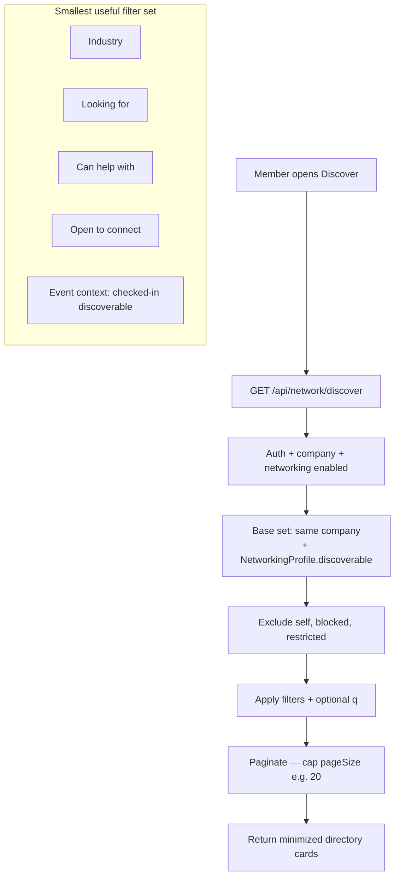
```mermaid
flowchart TD
  USER[Member opens Discover] --> API[GET /api/network/discover]
  API --> GATE[Auth + company + networking enabled]
  GATE --> BASE[Base set: same company<br/>+ NetworkingProfile.discoverable]
  BASE --> EXCL[Exclude self, blocked, restricted]
  EXCL --> FILTER[Apply filters + optional q]
  FILTER --> PAGE[Paginate — cap pageSize e.g. 20]
  PAGE --> CARDS[Return minimized directory cards]

  subgraph Filters["Smallest useful filter set"]
    F1[Industry]
    F2[Looking for]
    F3[Can help with]
    F4[Open to connect]
    F5[Event context: checked-in discoverable]
  end
```

---

## 10. Search Architecture

MVP = Prisma + MySQL filters — no Elasticsearch unless scale demands later.

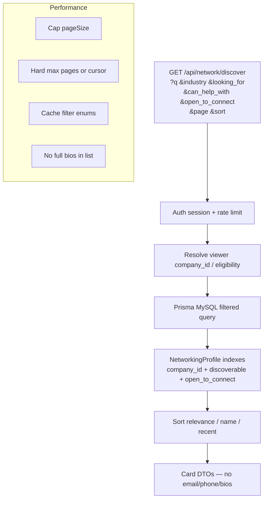
```mermaid
flowchart TD
  Q["GET /api/network/discover<br/>?q &industry &looking_for<br/>&can_help_with &open_to_connect<br/>&page &sort"] --> RL[Auth session + rate limit]
  RL --> RESOLVE[Resolve viewer company_id / eligibility]
  RESOLVE --> SQL[Prisma MySQL filtered query]
  SQL --> IDX[NetworkingProfile indexes<br/>company_id + discoverable + open_to_connect]
  IDX --> SORT[Sort relevance / name / recent]
  SORT --> OUT[Card DTOs — no email/phone/bios]

  subgraph Perf["Performance"]
    P1[Cap pageSize]
    P2[Hard max pages or cursor]
    P3[Cache filter enums]
    P4[No full bios in list]
  end
```

---

## 11. Directory Card → Profile View

Cards answer “why connect”; detail answers four questions.

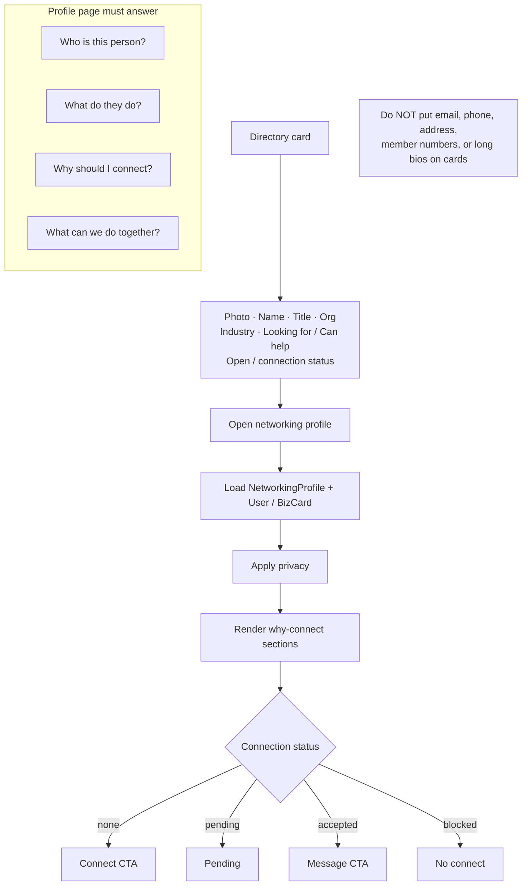
```mermaid
flowchart TD
  CARD[Directory card] --> SHOW[Photo · Name · Title · Org<br/>Industry · Looking for / Can help<br/>Open / connection status]
  SHOW --> OPEN[Open networking profile]
  OPEN --> LOAD[Load NetworkingProfile + User / BizCard]
  LOAD --> PRIV[Apply privacy]
  PRIV --> UI[Render why-connect sections]
  UI --> CTA{Connection status}
  CTA -->|none| CONNECT[Connect CTA]
  CTA -->|pending| WAIT[Pending]
  CTA -->|accepted| MSG[Message CTA]
  CTA -->|blocked| NONE[No connect]

  subgraph MustAnswer["Profile page must answer"]
    Q1[Who is this person?]
    Q2[What do they do?]
    Q3[Why should I connect?]
    Q4[What can we do together?]
  end

  note1[Do NOT put email, phone, address,<br/>member numbers, or long bios on cards]
```

---

## 12. Connection Lifecycle

Reuse existing Associates — never invent `NetworkingConnection`.

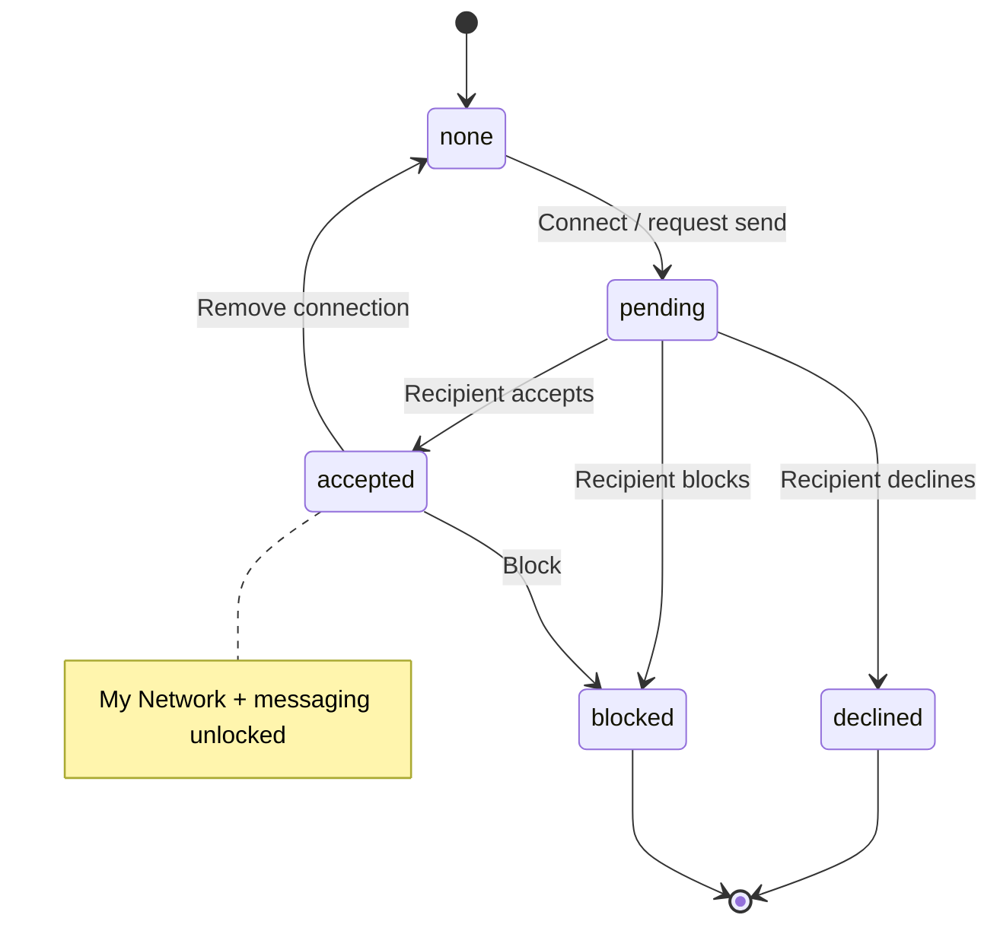
```mermaid
stateDiagram-v2
  [*] --> none
  none --> pending: Connect / request send
  pending --> accepted: Recipient accepts
  pending --> declined: Recipient declines
  pending --> blocked: Recipient blocks
  accepted --> none: Remove connection
  accepted --> blocked: Block
  declined --> [*]
  blocked --> [*]

  note right of accepted
    My Network + messaging unlocked
  end note
```

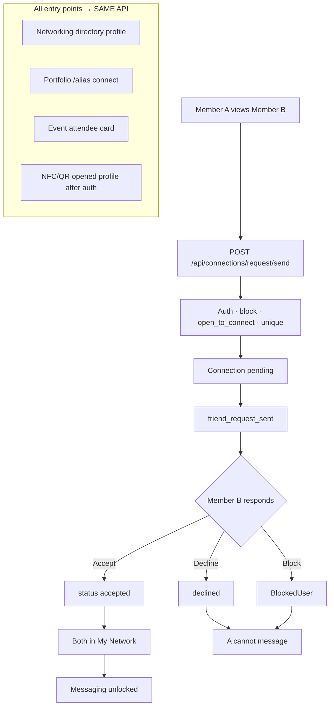
```mermaid
flowchart TD
  A[Member A views Member B] --> SEND[POST /api/connections/request/send]
  SEND --> CHK[Auth · block · open_to_connect · unique]
  CHK --> PEND[Connection pending]
  PEND --> NOTIFY[friend_request_sent]
  NOTIFY --> B{Member B responds}
  B -->|Accept| ACC[status accepted]
  B -->|Decline| DEC[declined]
  B -->|Block| BLK[BlockedUser]
  ACC --> NET[Both in My Network]
  NET --> MSG[Messaging unlocked]
  DEC --> STOP[A cannot message]
  BLK --> STOP

  subgraph EntryPoints["All entry points → SAME API"]
    E1[Networking directory profile]
    E2[Portfolio /alias connect]
    E3[Event attendee card]
    E4[NFC/QR opened profile after auth]
  end
```

---

## 13. My Network

Evolve `/user/associate` as My Network.

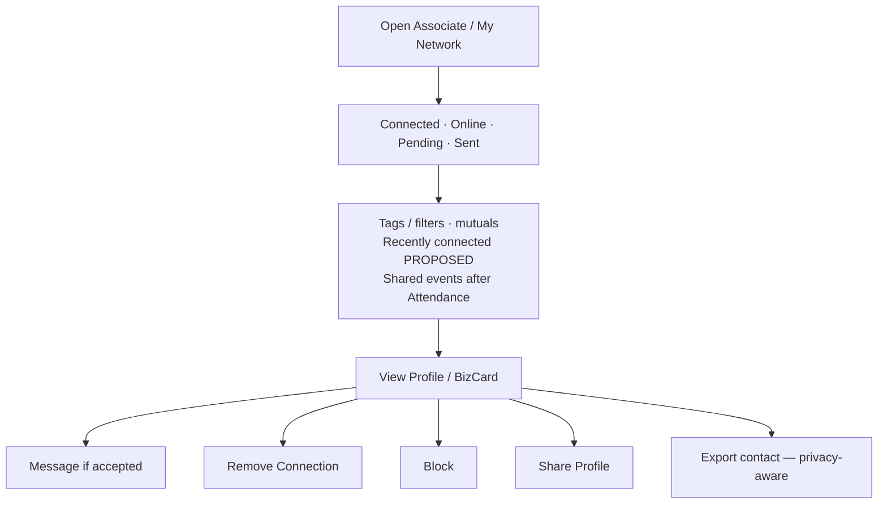
```mermaid
flowchart TD
  OPEN[Open Associate / My Network] --> TABS[Connected · Online · Pending · Sent]
  TABS --> SHOW[Tags / filters · mutuals<br/>Recently connected PROPOSED<br/>Shared events after Attendance]
  SHOW --> ACT[View Profile / BizCard]
  ACT --> MSG[Message if accepted]
  ACT --> REM[Remove Connection]
  ACT --> BLK[Block]
  ACT --> SHARE[Share Profile]
  ACT --> VCF[Export contact — privacy-aware]
```

---

## 14. Messaging Integration

Do **not** create a second messenger.

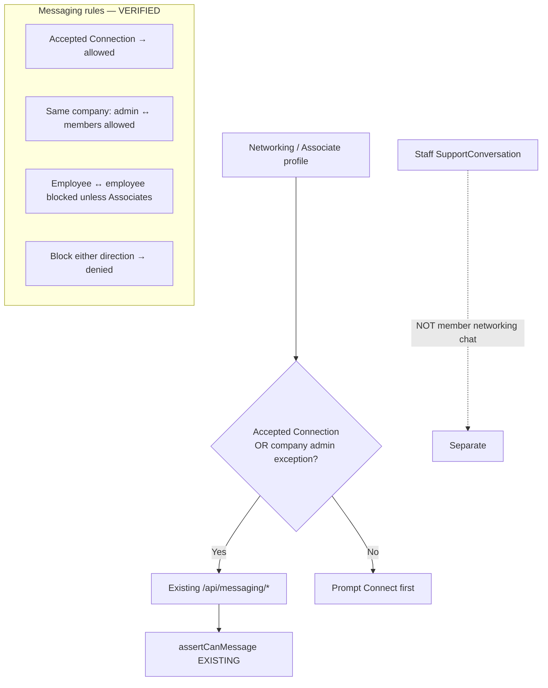
```mermaid
flowchart TD
  PROFILE[Networking / Associate profile] --> NEED{Accepted Connection<br/>OR company admin exception?}
  NEED -->|Yes| DM[Existing /api/messaging/*]
  NEED -->|No| PROMPT[Prompt Connect first]
  DM --> RULES[assertCanMessage EXISTING]

  subgraph Rules["Messaging rules — VERIFIED"]
    R1[Accepted Connection → allowed]
    R2[Same company: admin ↔ members allowed]
    R3[Employee ↔ employee blocked unless Associates]
    R4[Block either direction → denied]
  end

  SUPPORT[Staff SupportConversation] -.->|NOT member networking chat| X[Separate]
```

---

## 15. NFC Networking Flow

NFC identifies profile/credential — never auto-connects.

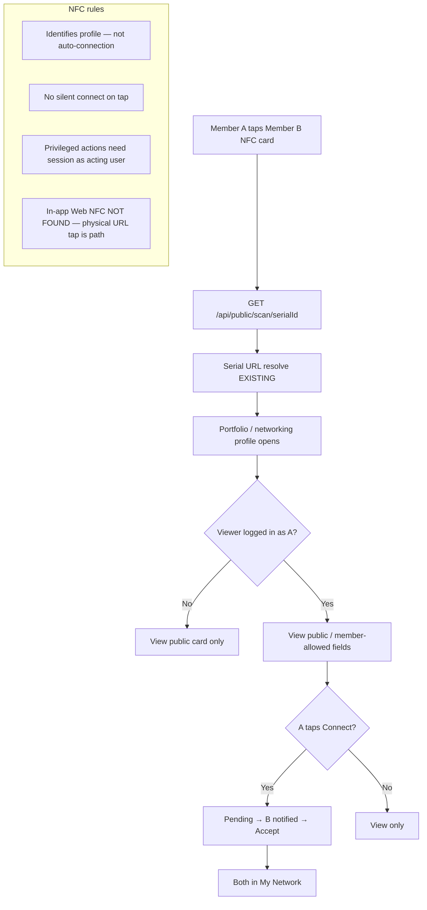
```mermaid
flowchart TD
  TAP[Member A taps Member B NFC card] --> SCAN[GET /api/public/scan/serialId]
  SCAN --> RESOLVE[Serial URL resolve EXISTING]
  RESOLVE --> PORT[Portfolio / networking profile opens]
  PORT --> AUTH{Viewer logged in as A?}
  AUTH -->|No| PUB[View public card only]
  AUTH -->|Yes| VIEW[View public / member-allowed fields]
  VIEW --> CONN{A taps Connect?}
  CONN -->|Yes| PEND[Pending → B notified → Accept]
  CONN -->|No| DONE[View only]
  PEND --> NET[Both in My Network]

  subgraph Rules["NFC rules"]
    N1[Identifies profile — not auto-connection]
    N2[No silent connect on tap]
    N3[Privileged actions need session as acting user]
    N4[In-app Web NFC NOT FOUND — physical URL tap is path]
  end
```

---

## 16. QR Networking Flow

Same resolve → profile → connect pipeline as NFC.

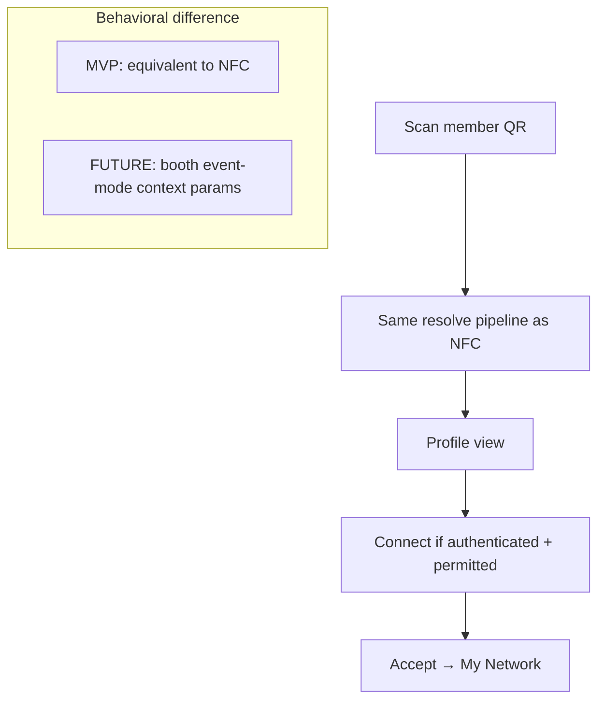
```mermaid
flowchart TD
  QR[Scan member QR] --> SAME[Same resolve pipeline as NFC]
  SAME --> PROFILE[Profile view]
  PROFILE --> CONN[Connect if authenticated + permitted]
  CONN --> NET[Accept → My Network]

  subgraph Diff["Behavioral difference"]
    D1[MVP: equivalent to NFC]
    D2[FUTURE: booth event-mode context params]
  end
```

---

## 17. Profile Sharing

Public link never grants privileged actions.

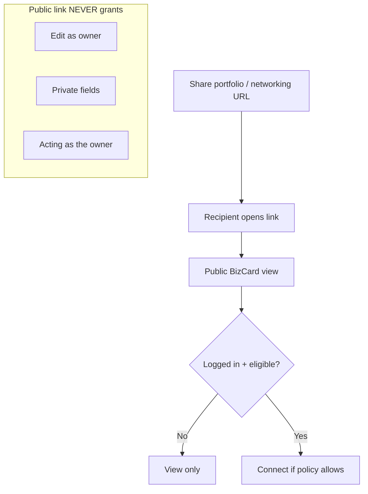
```mermaid
flowchart TD
  SHARE[Share portfolio / networking URL] --> RECIP[Recipient opens link]
  RECIP --> VIEW[Public BizCard view]
  VIEW --> AUTH{Logged in + eligible?}
  AUTH -->|No| PUBLIC[View only]
  AUTH -->|Yes| CONN[Connect if policy allows]

  subgraph Never["Public link NEVER grants"]
    X1[Edit as owner]
    X2[Private fields]
    X3[Acting as the owner]
  end
```

---

## 18. Event-Based Networking

People at event = checked-in + discoverable + event-visible.

```mermaid
flowchart TD
  EVT[ManagedEvent] --> CI[Member checks in<br/>Attendance SoT]
  CI --> UNLOCK[Event networking unlocked for that member]
  UNLOCK --> LIST[People at this Event]
  LIST --> FILT[Filter by industry / intent]
  FILT --> VIEW[View profile]
  VIEW --> CONN[Connect]
  CONN --> MSG[Follow up via Messages]

  subgraph WhoAppears["Who appears — CHOSEN"]
    W1[Checked-in + discoverable + event-visible]
  end

  subgraph Rejected["Rejected candidate sets"]
    R1[All registered — too broad]
    R2[All org members — not event-specific]
    R3[RSVP-only — weak signal]
  end
```

---

## 19. Attendance → Event Networking

Networking reads attendance; never writes it.

```mermaid
flowchart TD
  ATT[EventAttendance CHECKED_IN] --> READ[Networking reads attendance]
  READ --> SEC[Server verifies ALL gates]
  SEC --> DIR[Event directory query]
  DIR --> NOWRITE[Networking does NOT write attendance]

  subgraph Gates["Event networking security — all required"]
    G1[Viewer authenticated]
    G2[Viewer eligible for event]
    G3[Viewer checked-in]
    G4[Target checked-in]
    G5[Target discoverable + visible_at_events]
    G6[Org networking enabled]
    G7[Not blocked]
  end

  note1[Do not trust client event-mode flags alone]
  note2[Do not fake venue networking from calendar RSVP]
```

---

## 20. Recommendations & Why Connect

Deterministic MVP rules — no AI.

```mermaid
flowchart TD
  CAND[Same org · not connected · discoverable] --> S1[Score: looking_for ↔ can_help_with]
  S1 --> S2[+ Same industry]
  S2 --> S3[+ Shared event if Attendance]
  S3 --> S4[+ Mutual connections count]
  S4 --> S5[+ Both open_to_connect]
  S5 --> REASON[Explainable reason string]
  REASON --> UI[People you may want to meet]

  UPGRADE[/api/connections/suggestions<br/>upgrade from naïve newest users/]
  UPGRADE --> FALLBACK[Fallback if no NetworkingProfile]

  AI[Future AI embeddings] -.->|FUTURE PHASE| OUT[Out of MVP]

  subgraph WhyConnect["Prefer relevance over bare name"]
    W1[Jane Doe]
    W2[Construction Consultant · ABC]
    W3[Looking for: partnerships]
    W4[Can help with: project management]
  end
```

---

## 21. Networking Intent

Looking for ↔ Can help with catalogs.

```mermaid
flowchart LR
  subgraph LookingFor["Looking for — MVP enums"]
    L1[clients]
    L2[partners]
    L3[suppliers]
    L4[collaborators]
    L5[opportunities]
  end

  subgraph CanHelp["Can help with — MVP"]
    C1[consulting]
    C2[marketing]
    C3[technology]
    C4[sales]
    C5[training]
    C6[supplies / products]
  end

  LookingFor <-->|complementary match| CanHelp
  CAT[Platform defaults first<br/>Org-overridable catalogs Phase 2]
```

---

## 22. Block / Report / Moderation

```mermaid
flowchart TD
  USER[Member] --> BLOCK[Block — VERIFIED EXISTING<br/>BlockedUser + respond block]
  USER --> REPORT[POST /api/network/reports PROPOSED]
  REPORT --> QUEUE[Company admin first-line]
  QUEUE --> ESC[Escalate Superadmin]
  ESC --> ACTION[Hide profile / force undiscoverable<br/>Suspend networking / platform restrict]

  BLOCK --> STOP[Stops requests + messaging both ways]

  subgraph Reasons["Report reasons"]
    R1[Spam]
    R2[Harassment]
    R3[Inappropriate content]
    R4[Impersonation]
    R5[Suspicious / other]
  end

  subgraph NotByDefault["Staff default"]
    N1[No org directory browse of clients]
    N2[No private fields / DMs]
    N3[Reports only if assigned permission]
  end
```

---

## 23. Roles — Staff / Superadmin / Org Admin

```mermaid
flowchart TD
  subgraph Staff["Platform Staff /staff"]
    S1[Own Associate UI — YES]
    S2[Client org directory — NO unless permission]
    S3[Private fields / DMs — NO]
    S4[Networking reports — only if assigned]
  end

  subgraph Superadmin["Superadmin"]
    SA1[Feature flags / org policies]
    SA2[Moderation escalation]
    SA3[Abuse / scrape rate policy]
    SA4[Platform adoption aggregates]
  end

  subgraph OrgAdmin["Organization Admin /admin"]
    O1[Networking enabled / disabled]
    O2[Member discovery within company]
    O3[Event networking when Attendance exists]
    O4[Default visibility policy]
    O5[Moderation of reports]
    O6[Custom field catalogs — Phase 2]
  end

  OrgAdmin --> BOUNDARY[Members of Org A do NOT appear<br/>in Org B private directory — MVP]
```

---

## 24. Cross-Organization Architecture

MVP = org-only; long-term = member-choice scope.

```mermaid
flowchart TD
  subgraph Platform["TAP Platform"]
    subgraph OrgA["Organization A"]
      A1[Members]
      A2[Directory private]
      A3[Events]
    end
    subgraph OrgB["Organization B"]
      B1[Members]
      B2[Directory private]
      B3[Events]
    end
    GLOBAL[Global Discoverable Members<br/>opt-in only — Phase 2+]
  end

  subgraph Decision["Scope decision"]
    D1[A. Inside org only — MVP DEFAULT]
    D2[B. Across all TAP orgs — DEFERRED]
    D3[C. Member chooses org / platform — LONG-TERM]
  end

  MVP[MVP implements only per-org private directories] --> FUTURE[Phase 2 member opt-in scope]
  FUTURE --> GLOBAL
```

---

## 25. Membership Eligibility

Consume eligibility; retain connection history on expiry.

```mermaid
flowchart TD
  subgraph Interim["Interim TODAY"]
    I1[Active user + company member + not restricted] --> OK[Networking allowed]
    I2[is_restricted / deactivated] --> OFF[Networking disabled]
    I3[No company affiliation] --> NO_DIR[No org directory<br/>may still use Associates via portfolio]
  end

  subgraph Future["Future Membership SoT"]
    F1[Active] --> FULL[Full networking]
    F2[Expired] --> POL{Org policy}
    POL -->|hide| HIDE[Undiscoverable]
    POL -->|readonly| RO[View only — no new connects]
    POL -->|grace| GRACE[Temporary full access]
    F3[Suspended / Cancelled] --> REVOKED[Networking disabled]
  end

  HIST[Do NOT delete historical Connection rows<br/>Preserve relationship history — gate new actions]
```

---

## 26. NFC / QR Identity Security

Public credential ≠ privileged session.

```mermaid
flowchart TD
  subgraph Threats["Threats"]
    T1[Cloned NFC / copied QR]
    T2[Shared profile URL]
    T3[Stolen link]
    T4[Impersonation]
    T5[Session abuse]
  end

  subgraph Mitigations["Mitigations"]
    M1[Opens same public profile — no privileged session]
    M2[View ≠ act as owner]
    M3[Connect/message require attacker auth — victim not impersonated]
    M4[BizCard ownership + report / moderation]
    M5[Existing session auth on connect/message APIs]
  end

  T1 --> M1
  T2 --> M2
  T3 --> M3
  T4 --> M4
  T5 --> M5

  INV[INVARIANT: Public URL / NFC / QR identify credential.<br/>Protected actions need authenticated authorization as acting member.]
```

---

## 27. Connection Security & Concurrency

```mermaid
flowchart TD
  subgraph Security["Connection security"]
    S1[Session-bound APIs only]
    S2[@@unique requester + recipient]
    S3[Idempotent send → existing pending]
    S4[Only recipient may accept]
    S5[No secret in URL that auto-accepts]
    S6[Rate limits + open_to_connect + blocks]
  end

  subgraph Concurrency["Concurrency — safe behavior"]
    C1[A requests while B blocks A → block wins]
    C2[A→B and B→A pending → merge in transaction]
    C3[Concurrent accept/reject → status precondition]
  end

  subgraph Idempotency["Idempotency"]
    I1[Duplicate request → 200 existing pending]
    I2[Double accept/decline → no-op]
    I3[Repeated NFC/QR → resolve only — no extra edges]
    I4[Duplicate report → dedupe window]
  end
```

---

## 28. Fraud / Abuse Map

```mermaid
flowchart TD
  subgraph Abuse["Key threats"]
    A1[Fake profile / impersonation]
    A2[Spam connection requests]
    A3[Directory scraping]
    A4[Cloned NFC / fake QR]
    A5[Fake networking for rewards]
    A6[Harassment / false reports]
  end

  subgraph Prevention["Prevention"]
    P1[Membership / company gates]
    P2[Rate limits · open_to_connect]
    P3[Pagination · field minimize · org boundary]
    P4[Public view only on scan]
    P5[No auto loyalty · qualify accepts]
    P6[Block + report + messaging gates]
  end

  A1 --> P1
  A2 --> P2
  A3 --> P3
  A4 --> P4
  A5 --> P5
  A6 --> P6
```

---

## 29. Conceptual Data Model

Reuse Connection; add NetworkingProfile + reports only.

```mermaid
erDiagram
  User ||--o| NetworkingProfile : has
  User ||--o| Bizcard : owns
  User ||--o{ CompanyEmployee : affiliated
  Company ||--o{ CompanyEmployee : employs
  Company ||--o{ NetworkingProfile : "directory scope"
  NetworkingProfile }o--o| Bizcard : "primary_bizcard_id"
  User ||--o{ Connection : requester
  User ||--o{ Connection : recipient
  User ||--o{ BlockedUser : blocks
  User ||--o{ NetworkingProfileReport : reports
  User ||--o{ NetworkingProfileReport : "is reported"
  Connection ||--o{ ConnectionTag : tagged
  User ||--o{ DirectConversation : peers
  ManagedEvent ||--o{ EventAttendance : "SHARED attendance"
  User ||--o{ EventAttendance : attends

  NetworkingProfile {
    bigint user_id PK
    bigint company_id
    bigint primary_bizcard_id
    string headline
    string industry
    string what_i_do
    string looking_for
    string can_help_with
    bool discoverable
    bool open_to_connect
    bool show_email
    bool show_phone
    bool visible_at_events
    int completion_score
  }

  Connection {
    bigint requester_user_id
    bigint recipient_user_id
    string status
    string relationship_type
  }

  NetworkingProfileReport {
    bigint report_id
    bigint reporter_user_id
    bigint reported_user_id
    string reason
    string status
  }
```

```mermaid
flowchart LR
  subgraph NotMVP["Explicitly NOT required for MVP"]
    X1[Separate ConnectionRequest table]
    X2[ProfileView duplicate]
    X3[EventNetworkingSession table]
    X4[Followers graph]
  end
```

---

## 30. API Surface Map

Keep connection/messaging engines; add `/api/network/**`.

```mermaid
flowchart TD
  subgraph Keep["Keep unchanged — relationship engines"]
    K1[/api/connections/**]
    K2[/api/messaging/**]
    K3[/api/portfolio/uri/connect]
    K4[/api/public/scan/serialId]
  end

  subgraph New["New — PROPOSED /api/network"]
    N1[GET/PUT /api/network/profile]
    N2[GET /api/network/profile/userId]
    N3[GET /api/network/discover]
    N4[GET /api/network/recommendations]
    N5[GET /api/network/events/eventId/attendees]
    N6[POST /api/network/reports]
    N7[GET /api/network/reports — admin]
    N8[GET/PUT /api/company/network/settings]
  end

  N3 --> CARD[Directory cards]
  CARD --> K1
  N2 --> K1
  N5 --> K1
  K1 -->|accepted| K2
```

---

## 31. System Integration Map

Who owns what; what Networking consumes.

```mermaid
flowchart TD
  MEM[Membership / CompanyEmployee] -->|eligibility| NET[Networking]
  UID[Member Identity User] -->|actor| NET
  NFC[NFC / QR] -->|open profile entry| NET
  BIZ[BizCard] -->|public face| NET
  NP[NetworkingProfile] -->|intent + privacy| NET
  DISC[Discovery] -->|feeds Connect| CONN[Connection Associates]
  CONN --> MSG[Messaging]
  ATT[Events / Attendance] -->|event directories| NET
  NOTIF[Notifications] -->|request / accept / DM| NET
  MISS[Missions / Loyalty] -->|optional qualified hooks only| NET
```

---

## 32. Loyalty / Missions Hooks

No auto-points for networking spam.

```mermaid
flowchart TD
  ACT[Networking action] --> QUAL{Configured + anti-abuse pass?}
  QUAL -->|No| NONE[No points / no progress]
  QUAL -->|Yes| MISSION[Optional Mission progress]
  MISSION --> REWARD[Existing Rewards]

  subgraph Qualify["What may qualify later"]
    Q1[Connection request alone — NO]
    Q2[Accepted connection — only with anti-abuse + policy]
    Q3[Complete profile — possible low-value once]
    Q4[Event networking after check-in — prefer attendance hooks]
  end

  subgraph Missions["Optional missions — default OFF"]
    M1[Complete networking profile]
    M2[Connect with N accepted members]
    M3[Meet N members at event — needs Attendance]
  end

  note1[Successful networking ≠ request<br/>Prefer accepted + verified co-presence]
```

---

## 33. Navigation IA

Evolve Associate into a Network group.

```mermaid
flowchart TD
  subgraph Current["CURRENT — VERIFIED"]
    C1[Associate → /user/associate]
  end

  subgraph Proposed["PROPOSED IA"]
    N[Network]
    N --> D[Discover → /user/network/discover]
    N --> M[My Network → /user/associate]
    N --> R[Requests — tab within My Network]
    N --> P[My Profile → /user/network/profile]
    N --> E[Events → /user/network/events<br/>when Attendance exists]
  end

  Current --> Proposed

  subgraph Dashboard["Dashboard widgets — sparse"]
    W1[Pending connection requests]
    W2[Profile completion nudge]
    W3[People you may want to meet — small]
  end
```

---

## 34. MVP vs Future

```mermaid
flowchart TD
  subgraph MVP["MVP — must ship"]
    M1[NetworkingProfile fields + privacy]
    M2[Same-company directory + search]
    M3[Existing Connection lifecycle]
    M4[Portfolio URL / QR / NFC → profile → connect]
    M5[Reuse messaging]
    M6[Privacy + rate limits + org boundary]
    M7[Event networking stub/hook until Attendance]
  end

  subgraph Out["Explicitly out of MVP"]
    O1[Connection request notes]
    O2[AI recommendations]
    O3[Cross-org directory]
    O4[Loyalty auto-points]
    O5[Viewer social feed]
    O6[Custom org field builders]
  end

  subgraph Phase2["Phase 2"]
    P1[Request notes]
    P2[Stronger recommendations]
    P3[Event networking UX polish]
    P4[Org custom intent catalogs]
    P5[Report admin UX]
    P6[Member-choice cross-org scope]
  end

  subgraph Future["Future"]
    F1[AI / proximity / CRM]
    F2[Reputation / endorsements]
    F3[Global discovery / monetization]
  end

  MVP --> Phase2 --> Future
```

---

## 35. Implementation Order

Documentation phase does not implement.

```mermaid
flowchart TD
  P1[1. NetworkingProfile foundation + edit UI] --> P2
  P2[2. Privacy / discoverability enforcement] --> P3
  P3[3. Member directory / search APIs + UI] --> P4
  P4[4. Wire directory → existing Connection APIs<br/>upgrade suggestions] --> P5
  P5[5. NFC/QR entry CTAs — no auto-connect] --> P6
  P6[6. Messaging CTA alignment] --> P7
  P7[7. Event networking after Attendance MVP] --> P8
  P8[8. Reports / moderation / rate-limit hardening] --> P9
  P9[9. Org/platform aggregate analytics] --> P10
  P10[10. Optional Missions / loyalty policy hooks]
```

---

## 36. End-to-End Whole Flow

Complete path from eligibility → discovery → relationship → event networking.

```mermaid
flowchart TD
  Start([Member activates / joins company]) --> Elig{Active + not restricted<br/>+ company affiliated?}
  Elig -->|No| Blocked[Networking disabled / no org directory]
  Elig -->|Yes| Nudge[Nudge: Complete NetworkingProfile]
  Nudge --> Edit[Headline · industry · what I do<br/>Looking for · Can help with]
  Edit --> Privacy[Set discoverable / open_to_connect<br/>email-phone toggles · event visibility]
  Privacy --> Ready[Profile ready]

  Ready --> Discover[Open Discover — same company]
  Discover --> Search[Search / filter by industry · intent]
  Search --> Card[Directory card — why connect line]
  Card --> Profile[View networking profile]
  Profile --> Why[Who · What · Why connect · Together]
  Why --> Connect{Connect?}

  Connect -->|Yes| Send[POST /api/connections/request/send]
  Send --> Pending[PENDING + notify B]
  Pending --> Respond{B Accept / Decline / Block}
  Respond -->|Accept| Accepted[ACCEPTED — My Network]
  Respond -->|Decline/Block| StopConn[No messaging]
  Accepted --> Message[Existing messaging unlocked]
  Message --> Relationship[Relationship follow-up]

  subgraph Physical["Physical identity entry"]
    NFC[NFC tap serial] --> Scan[Public scan resolve]
    QR[QR scan] --> Scan
    Share[Shared portfolio URL] --> Scan
    Scan --> OpenProf[Open BizCard / network profile]
    OpenProf --> AuthGate{Authenticated as self?}
    AuthGate -->|No| PublicOnly[Public view only]
    AuthGate -->|Yes| Connect
  end

  subgraph EventPath["Event networking — after Attendance"]
    Event[ManagedEvent] --> CheckIn[Check-in Attendance SoT]
    CheckIn --> People[People at Event<br/>checked-in + discoverable + event-visible]
    People --> Profile
  end

  Ready --> Recs[Deterministic recommendations]
  Recs --> Card

  OrgAdmin[Company admin enables networking] --> Discover

  Accepted -.->|FUTURE optional| Missions[Missions / Loyalty<br/>accepted only + anti-abuse]
```

---

## Narrative summary

**Membership / company affiliation** establishes eligibility → **User** is the actor → **NFC/QR** opens **BizCard** (public face) → **NetworkingProfile** adds intent + privacy → **Discovery** finds relevant same-org members → **Connection (Associates)** creates the trust edge → **Messaging** enables follow-up → **Event networking** consumes **Attendance** check-in for “people here” → optional **Missions/Loyalty** only when configured with anti-abuse.

**Final architecture pillars:** Separate `NetworkingProfile` layer · do not replace BizCard · do not fork Associates · org-scoped MVP directory · opt-in discoverability · NFC/QR never auto-connect · event lists require checked-in + discoverable · field-minimized APIs · company admin owns org policy.

---

*End of Mermaid architecture document. Source of truth for product decisions remains [`Networking Profiles for Members.md`](../Networking%20Profiles%20for%20Members.md).*
